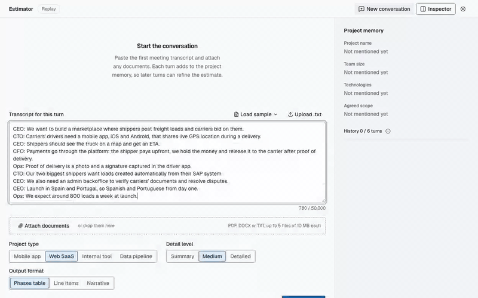
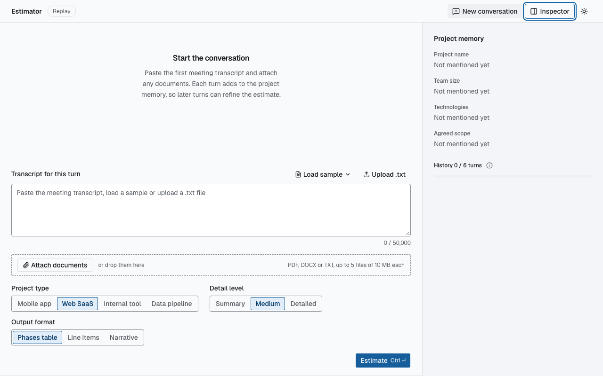
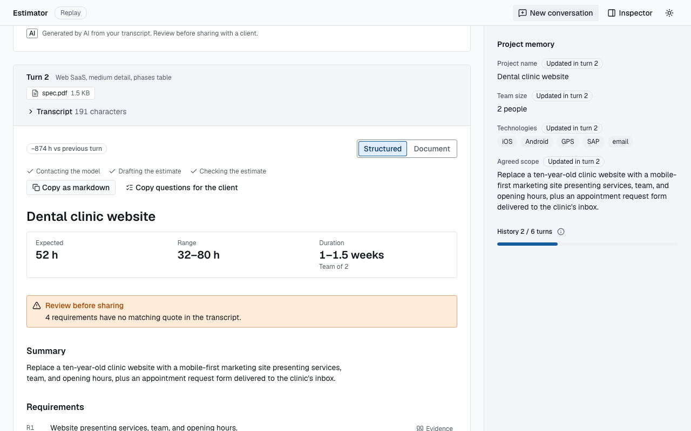
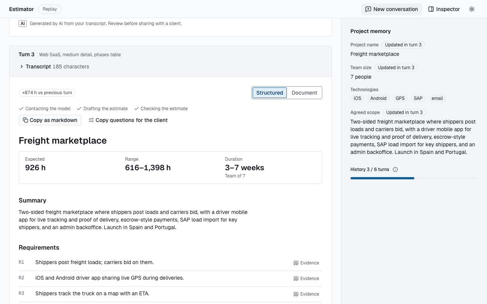
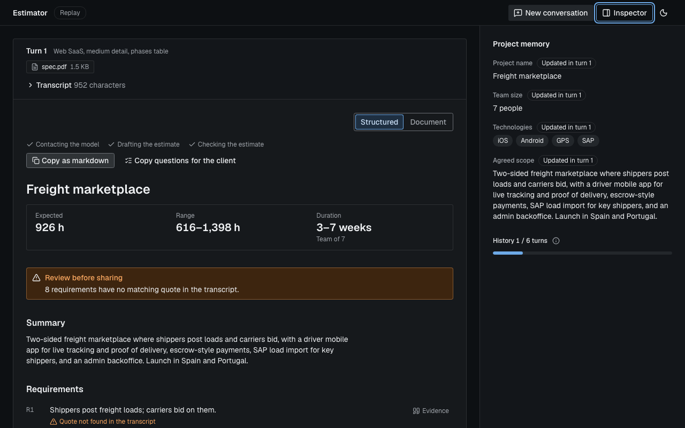
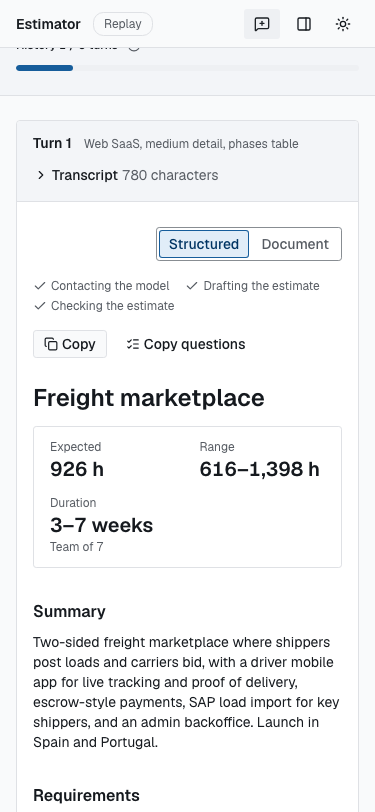

# lidr-ai-eng

Project for the LIDR AI Engineering course, grown one branch per course brief.

**M1 (session 2): CAG software estimator.** A FastAPI service that turns a meeting transcription into a software estimation produced by an LLM, using Cache-Augmented Generation: all reference context (three typed past estimations) travels inside a cache-stable system prompt, with no database or retrieval. The model returns a structured breakdown; totals, grounding checks and the markdown report are computed in code.

**Session 3 (branch `pre-session-03`): conversational interface with streaming.** A Next.js web app (UI plus a backend-for-frontend) where you paste a transcript into a chat and watch the estimate build live. The AI service gained an SSE endpoint that streams validated partial snapshots of the structured estimate, a fallback router (OpenAI, then Anthropic) with cooldown, a Redis exact-match response cache that fails open, per-call cost and latency metrics, and a `replay` provider that serves recorded streams with no API key and no spend. What the branch taught, with a quiz: [`docs/takeaways/session-03.md`](docs/takeaways/session-03.md).

**Session 4 (branch `pre-session-04`): from chat to product interface.** The chat became a typed form (transcript plus project type, detail level and output format), and the prompt moved into versioned Jinja2 templates under `app/prompts/estimation/<version>/`, with template tests that run offline in milliseconds. Requests can pick a prompt version with `?prompt_version=`. Prompt `v2` adds an explicit frontend-coverage rule, measured by a new eval check, and is the default for single-shot requests. Results open in a split view that links each requirement to its quote in the transcript, with a Structured / Document toggle for the server's markdown in the chosen output format. What the branch taught, with a quiz: [`docs/takeaways/session-04.md`](docs/takeaways/session-04.md).

**Session 5 (branch `pre-session-05`): conversational memory and enriched context.** The estimator became a conversation. `POST /sessions` starts a session, and each turn sends the transcript, the typed choices and up to five PDF, DOCX or text attachments as one multipart request. The AI service keeps a sliding window of the last six turns and a small set of project facts (name, team size, technologies, scope), merged in code from each structured answer and injected into the next turn's system prompt through prompt `v3`. Attachments are extracted locally (pypdf, python-docx) in a killable child process, and their text joins the transcript, so the estimate can quote them. In the browser, a session workspace replaced the single-shot page: a thread of turns, a composer with attachments, and the project memory beside them. What the branch taught, with a quiz: [`docs/takeaways/session-05.md`](docs/takeaways/session-05.md).

## Architecture

```
Browser
  │  same origin only: POST /api/sessions, GET /api/sessions/{id}, POST /api/sessions/{id}/estimate/stream (multipart in, SSE out),
  │  GET /api/context; POST /api/estimate/stream (SSE) stays for API clients
  ▼
web/  Next.js 16 App Router, port 3000 (published on 127.0.0.1 only)
  ├─ React UI        session workspace: thread of turn cards (transcript with evidence highlights, progressive estimate),
  │                  composer (typed form + attachments), project memory and history meter, inspector sheet
  └─ BFF handlers    Host allowlist, same-origin POSTs, fixed upstream paths, checked query values and session ids, header allowlist,
                     body caps (2 MB JSON; 5 × 10 MiB + 1 MiB multipart, part count bounded, fields allowlisted and rebuilt), abort propagation
  │  http://ai-service:8000, Compose network only (AI_SERVICE_URL, server-side)
  ▼
ai-service  FastAPI (repository root, app/)
  ├─ POST /api/v1/estimate          blocking JSON (?prompt_version, ?refresh)
  ├─ POST /api/v1/estimate/stream   SSE: status, partial…, then exactly one result | error
  ├─ GET  /api/v1/context           system prompt for the given choices and version, versions, references, chain, limits
  ├─ POST /sessions, GET /sessions/{id}
  ├─ POST /sessions/{id}/estimate[/stream]   multipart turn (transcript, choices, attachments) → TurnResponse, JSON or SSE
  ├─ ConversationService           per-session lock, prompt v3 + project metadata + history window, commit at the result, no cache
  │    ├─ InMemorySessionStore     ConversationHistory + ProjectMetadata per session (process memory, idle TTL, cap)
  │    └─ attachments              PDF / DOCX / text extraction in a killable forkserver child
  └─ EstimationService             shared by single-shot requests and session turns
       ├─ ResponseCache ─────────────► redis (exact-match, 24 h TTL, fail-open, 0.2 s bound per call; session turns bypass it)
       ├─ prompts estimation/<vN>/     Jinja2; static prefix first, then the enum blocks and (v3) the metadata block (provider prompt cache)
       ├─ FallbackProvider             chain in order, cooldown, falls back only before the first token
       │    ├─ OpenAI     Responses streaming        primary: gpt-4o-mini
       │    ├─ Anthropic  Messages streaming         fallback: claude-haiku-4-5
       │    └─ replay     recorded cassettes         no key, zero spend (tests, offline demos)
       ├─ PartialSnapshotter           jiter partial JSON → throttled `partial` events
       └─ estimation_math → grounding → rendering, as in M1
```

The AI service and Redis have no published ports in `compose.yaml`. API keys exist only in the `ai-service` container, read from `.env` through `env_file`; the browser and the web container never see one.

Inside the AI service:

```
routers/estimations.py           request validation as dependencies (422 before any LLM call or stream)
  └─ services/llm_service.py     EstimationService: estimate() and estimate_stream() share one pipeline
      ├─ services/cache.py       cache key (schema and prompt version, prompt hash, chain, generation params, rate/capacity), RedisCache, NullCache
      ├─ prompts/loader.py       Jinja2 estimation/<version>/{system,user,examples}.j2: system = rules + references, then the
      │                          output_format and detail_level blocks (v3: then <project_metadata>); user = project type,
      │                          <transcript> (v3: with attachment blocks), <output_language>
      ├─ services/providers/     fallback.py (router + cooldown), openai_provider.py, anthropic_provider.py,
      │                          replay_provider.py, factory.py (chain from settings), profiles.py (per-model params)
      ├─ services/streaming.py   PartialSnapshotter: partial parse, change detection, 100 ms throttle
      ├─ services/pricing.py     USD per 1M tokens (checked 2026-10-06), cost from usage incl. cache reads/writes
      ├─ estimation_math.py      PERT expected hours, totals, range, duration, cost
      ├─ grounding.py            evidence quotes checked against the client's text (transcript, attachments, earlier turns
      │                          still in the window); task basis checked
      └─ rendering.py            markdown in the output_format's layout, with ⚠ marks and a grounding warnings section;
                                 the compact assistant turn a session keeps
routers/sessions.py              session endpoints; one multipart form model; every check before a stream starts (404/409/422/503)
  └─ services/conversation.py    ConversationService: per-session lock, v3 render with metadata and attachments, history window,
      │                          commit at the result; estimates through the EstimationService above
      ├─ sessions.py             ConversationHistory (window), ProjectMetadata, merge_metadata, InMemorySessionStore
      └─ attachments/            extractor.py (pypdf, python-docx, text; budgets), isolation.py (forkserver child: timeout,
                                 rlimits, slots)
```

The API contract is generated from FastAPI and committed as [`contracts/openapi.json`](contracts/openapi.json); `web/` generates its TypeScript types from it (`make web-types`), and `make check` fails when either is stale.

Behavior is specified in [`openspec/specs/`](openspec/specs/). The M1 change and its design rationale are archived in [`openspec/changes/archive/2026-09-23-add-cag-estimator/`](openspec/changes/archive/2026-09-23-add-cag-estimator/) ([design](openspec/changes/archive/2026-09-23-add-cag-estimator/design.md)). Stack hardening after M1 (prompt-cache routing, effort levels per model, stricter gates) is in [`2026-09-23-harden-stack-usage/`](openspec/changes/archive/2026-09-23-harden-stack-usage/) ([design](openspec/changes/archive/2026-09-23-harden-stack-usage/design.md)), and the M1 review fixes (no transcript in logs at any level, failure causes in `llm_call` records, 60 s timeout) in [`2026-09-23-harden-observability/`](openspec/changes/archive/2026-09-23-harden-observability/) ([design](openspec/changes/archive/2026-09-23-harden-observability/design.md)). The session 3–5 catch-up runs OpenSpec-lite: specs are updated in place at the end of each branch, and the decisions with their rejected alternatives are in [`docs/catch-up/spec.md`](docs/catch-up/spec.md).

### Repository layout

| Path | What |
|---|---|
| `app/` | AI service (FastAPI): routers, services, providers, prompts, schemas, conversation sessions (`sessions.py`), attachment extraction (`attachments/`) |
| `web/` | Next.js UI and BFF, with its own `Dockerfile`, unit tests (`src/**/*.test.ts(x)`) and Playwright tests (`e2e/`) |
| `contracts/openapi.json` | Committed API contract (source of truth for the web types) |
| `compose.yaml`, `compose.dev.yaml`, `compose.e2e.yaml` | Whole system; dev override (reload, watch); offline e2e override |
| `Dockerfile` | AI service image (`dev` and `runtime` targets, non-root) |
| `tests/` | Offline test suite; `tests/cassettes/` recorded streams for `replay`; `tests/fixtures/sse/` recorded provider SSE bodies; `tests/fixtures/attachments/` PDF, DOCX and text fixtures with their generator |
| `scripts/` | OpenAPI export, live smoke tests (single-shot and a three-turn session), cassette and SSE-fixture recorders, spend guard, branch gate |
| `evals/` | Live prompt evaluation (golden set, reports, baseline) |
| `docs/` | Catch-up spec and plans, takeaways, media |

### Brief step → files (M1, session 2)

| Brief step | Files |
|---|---|
| Project structure | `app/`, `app/routers/`, `app/services/`, `app/context/` (checked by `tests/test_structure.py`) |
| Configuration and `.env` | `app/config.py`, `.env.example`, `.gitignore` |
| Reference estimations (≥ 2 examples) | `app/context/examples.py` (small, medium, large) |
| LLM service | `app/services/llm_service.py`, `app/services/providers/`, `app/prompts/` |
| Estimate endpoint | `app/routers/estimations.py`, `app/schemas/estimation.py` |
| Application and docs | `app/main.py` (`/health`, `/docs`) |
| Meeting transcription | `data/transcripts/course-meeting.md` |

## Setup

Requires [uv](https://docs.astral.sh/uv/) (Python 3.12 is pinned and installed by uv), Node 24 with pnpm 11 (`corepack enable pnpm`; the version is pinned in `web/package.json`), and Docker Engine 25+ with Compose 2.24+ (verified on Engine 29.4.3, Compose v5.1.3). Node also runs the OpenSpec CLI for `make specs`.

```bash
make install            # uv sync
make web-install        # pnpm -C web install --frozen-lockfile
cp .env.example .env    # then set the provider keys (see Configuration)
```

## Configuration

The AI service reads environment variables and `.env` (pydantic-settings; environment wins). Under Docker Compose it reads `.env` through `env_file` only, so a key exported in your host shell never reaches a container. Outside Docker, a shell-exported `ANTHROPIC_API_KEY` (for example inside Claude Code) wins over the one in `.env`.

| Variable | Default | Notes |
|---|---|---|
| `LLM_PROVIDER` | `openai` | `openai`, `anthropic` or `replay` (offline, needs no key) |
| `LLM_MODEL` | `gpt-4o-mini` | e.g. `claude-haiku-4-5`; server-side only; ignored by `replay` |
| `LLM_FALLBACKS` | `anthropic:claude-haiku-4-5` | comma-separated `provider:model` tried in order after the primary; `none` disables fallback (an empty value is ignored and keeps the default) |
| `OPENAI_API_KEY` / `ANTHROPIC_API_KEY` | — | required for every provider in the chain (primary and fallbacks, except `replay`); startup fails naming the missing one |
| `LLM_COOLDOWN_FAILURES`, `LLM_COOLDOWN_SECONDS` | `3`, `30` | after N consecutive availability failures a provider is skipped for that many seconds (per process) |
| `REDIS_URL` | unset | exact-match response cache; unset disables it. Compose sets it to its own Redis |
| `CACHE_TTL_SECONDS` | `86400` | cache entry lifetime |
| `REPLAY_CASSETTE_DIR` | `tests/cassettes` | where `replay` looks for recorded streams |
| `REPLAY_DELAY_SCALE` | `1` | `replay` pacing: `0` instant, `1` as recorded (a recorded estimate takes about 8–13 s end to end) |
| `LLM_TEMPERATURE` | `0.2` | sent only to models that support it |
| `LLM_REASONING_EFFORT` | unset | `none`/`minimal`/`low`/`medium`/`high`/`xhigh`/`max`; sent only to reasoning models that accept that level (others get no effort and a startup warning listing the supported levels) |
| `LLM_TIMEOUT_SECONDS`, `LLM_MAX_RETRIES`, `LLM_MAX_OUTPUT_TOKENS` | `60`, `2`, `4096` | the timeout applies per read; SDK retries apply only to the last provider in the chain (the router is the retry for the others) |
| `MAX_TRANSCRIPTION_CHARS` | `50000` | longer requests get `422`; the web form reads this limit from `/api/v1/context` |
| `PROMPT_VERSION` | `v2` | prompt template version under `app/prompts/estimation/` for single-shot requests; `?prompt_version=` overrides it per request; an unknown version stops startup. Session turns always use `v3` |
| `BLENDED_HOURLY_RATE`, `WEEKLY_CAPACITY_HOURS` | unset, `30` | cost and duration estimates (part of the cache key, since they are baked into cached totals) |
| `APP_ENV`, `LOG_LEVEL` | `development`, `DEBUG` | JSON logs on stderr; see Logging |
| `ALLOWED_HOSTS` | `localhost,127.0.0.1,ai-service,testserver` | comma-separated host names, without a port (unlike the BFF's variable of the same name), whose `Host` the API answers; anything else gets `400 invalid_host`. Add the name you call the API by if it is not one of these; an entry with a port fails startup |

Session 5 adds twelve settings for sessions and attachments (`MAX_TURNS`, `MAX_HISTORY_CHARS`, `SESSION_TTL_SECONDS`, `MAX_SESSIONS` and the `ATTACHMENT_*` settings), listed with their defaults in [Session 5: Settings](#settings). `.env.example` does not list them yet; their defaults apply unless you set them.

Web (`web/`):

| Variable | Default | Notes |
|---|---|---|
| `AI_SERVICE_URL` | — | absolute http(s) URL of the AI service, read per request on the server only; Compose sets `http://ai-service:8000` |
| `ALLOWED_HOSTS` | `localhost:3000,127.0.0.1:3000` | comma-separated `host:port` values the BFF answers (the browser's `Host` header); anything else gets `403`. Add the name and port you browse to if it is not one of these. Server-only; an empty value keeps the default |

Live tooling (read from the process environment, not by the app):

| Variable | Default | Notes |
|---|---|---|
| `LIVE_BUDGET_USD` | `5` | spend cap for `make smoke-live`, `make smoke-live-session`, `make record-cassettes` and `make eval`, checked against the ledger `docs/catch-up/spend.jsonl`; a command that could exceed it refuses to run |

**Logging.** `LOG_LEVEL` applies to the app's own loggers. The client libraries (`anthropic`, `openai`, `httpx2`, `httpcore2`) are kept at `INFO` or above whatever the level, because at `DEBUG` the Anthropic SDK logs request bodies, which contain the transcription. No log record contains the transcription or API keys.

- `llm_call`: one per LLM call that served or failed last, with provider, model, prompt version, token counts, `latency_ms`, `ttft_ms` (streaming), `cost_usd`, `stream`, `attempt`, `fallback`, `cache` (`hit|miss|error|bypass`) and `outcome` (`ok`, an error code, or `cancelled` when the client left). A failed call also carries `cause` (the stop condition, e.g. `stop_reason:max_tokens`, or the upstream error class) and `upstream_status`, never the provider's message.
- `llm_fallback` (warning): one per failed attempt that the router moved past, with that attempt's own latency and cause.
- `prompt_rendered`: one per prompt rendered for a provider call or a cache lookup, with `prompt_version` and `prompt_sha256` (of the system prompt and user message), never their content. The context endpoint and the startup check render without logging.
- `estimate_cache_hit`: a request served from the cache (no `llm_call`).
- `cache_error` (warning): a Redis failure, with the operation and exception class only.
- `attachment_rejected` (warning): an attachment turned into a `422` or `503`, with the reason (`invalid` or `busy`) only. Parse failures log `attachment parse failed: <exception type>`, and an extraction child killed at the timeout or one that died logs that (with its exit code when it died). No record contains attachment text.

Unhandled errors log the exception type and stack locations, not the message. Every response carries `X-Request-ID`, and the BFF forwards it.

## Run

### Docker Compose (whole system)

```bash
make up                 # build and start; returns once every healthcheck passes
make logs               # follow the logs
make down               # stop and remove the containers
make dev                # dev images: reload, compose watch syncs ./app and ./web, rebuilds on lockfile changes
```

- Open http://localhost:3000. Only `web` publishes a port, and only on loopback: there is no auth and the BFF spends the AI service's keys, so nothing is reachable from the LAN. `make dev` also publishes the AI service on http://localhost:8000, again loopback only. `tests/test_compose.py` enforces both rules. Loopback alone does not stop a web page that rebinds its own name to 127.0.0.1 (DNS rebinding), so both services also check `Host`: the BFF answers only the `host:port` values in its `ALLOWED_HOSTS` and refuses cross-site POSTs (`Sec-Fetch-Site`, `Origin`) with `403`, and the AI service answers only the host names in its own `ALLOWED_HOSTS` (`400 invalid_host` otherwise), so such a page cannot spend the keys through either port.
- `make up` uses your `.env`, so it makes live calls with your keys. For a zero-spend demo, run the offline stack the e2e tests use: `docker compose -f compose.yaml -f compose.e2e.yaml up --build --wait`. It sets `LLM_PROVIDER=replay` and `LLM_FALLBACKS=none`, disables the cache, mounts `tests/cassettes` read-only and drops `env_file` entirely (`!reset`), so the stack never holds a key. The UI's session turns render prompt `v3` with the session's memory and match no recorded cassette (those are recorded for `v2` single-shot calls), so every turn gets a synthesised stream: one of the three reference estimations, picked by a hash of the prompt, whatever the transcript and attachments say. A single-shot `POST /api/v1/estimate/stream` for a sample transcript with the default choices still replays its recording.
- The AI service runs one uvicorn worker (cooldown state, conversation sessions and the attachment-extraction slots are per process) with a 30 s graceful shutdown, so open streams can drain on `make down`. Restarting it ends every conversation.

### AI service alone

```bash
make run                # uv run uvicorn app.main:app --reload
```

Production-style (no `--reload`; the app factory reads settings from the environment):

```bash
uv run uvicorn app.main:create_app --factory --host 0.0.0.0 --port 8000 \
  --workers 1 --forwarded-allow-ips <proxy CIDR> --timeout-graceful-shutdown 30
```

- API docs: http://127.0.0.1:8000/docs
- Health: `curl http://127.0.0.1:8000/health` (reports the provider chain)

```bash
# Blocking
curl -s http://127.0.0.1:8000/api/v1/estimate \
  -H 'Content-Type: application/json' \
  -d "$(jq -Rs '{transcription: ., project_type: "mobile_app", detail_level: "medium", output_format: "phases_table"}' data/transcripts/course-meeting.md)" \
  | jq -r .estimation

# Streaming (Server-Sent Events); add ?refresh=true to skip the cache, ?prompt_version=v1 to pick a version
curl -N http://127.0.0.1:8000/api/v1/estimate/stream \
  -H 'Content-Type: application/json' \
  -d "$(jq -Rs '{transcription: ., project_type: "mobile_app", detail_level: "medium", output_format: "phases_table"}' data/transcripts/course-meeting.md)"
```

### Web alone

```bash
make run                                                  # AI service on :8000
AI_SERVICE_URL=http://localhost:8000 pnpm -C web dev      # then open http://localhost:3000
```

Use `localhost`, not `127.0.0.1`: `next dev` serves its dev resources only to the host it announces.

## API

| Endpoint | What |
|---|---|
| `POST /api/v1/estimate` | Blocking estimate as JSON |
| `POST /api/v1/estimate/stream` | Same body; `text/event-stream` response |
| `GET /api/v1/context` | Prompt version, `available_versions`, the system prompt rendered for `?project_type=&detail_level=&output_format=&prompt_version=` (defaults `web_saas`, `medium`, `phases_table` and `PROMPT_VERSION`), reference estimations, provider chain, `max_transcription_chars`, `max_attachments` and `max_attachment_bytes` (feed the inspector, the character counter and the dropzone) |
| `POST /sessions`, `GET /sessions/{id}`, `POST /sessions/{id}/estimate`, `POST /sessions/{id}/estimate/stream` | Conversational sessions with attachments (multipart); see [Session 5: endpoints](#endpoints) |
| `GET /health` | Status, version, environment, provider, model, chain |

Requests to the `/api/v1` estimate endpoints must be sent with `Content-Type: application/json`; other content types get `422 invalid_request`. Session turns are `multipart/form-data` (see Session 5). Request body: `transcription`, `project_type` (`mobile_app`, `web_saas`, `internal_tool`, `data_pipeline`), `detail_level` (`summary`, `medium`, `detailed`) and `output_format` (`phases_table`, `line_items`, `narrative`) are required; `output_language` is optional (defaults to the transcription's language). All three endpoints accept `?prompt_version=` (an unknown version is a `422`); both estimate endpoints accept `?refresh=true`, which skips the cache lookup and overwrites the entry (session 4's Regenerate; no page sends it since session 5).

Response fields: `estimation` (markdown), `breakdown` (structured, with computed `totals`), `grounding`, `model` and `provider` (the ones that actually served, after any fallback), `prompt_version`, `usage` (`input_tokens`, `output_tokens`, `cached_input_tokens`, `cache_write_tokens`) and `metrics`: `latency_ms` (end to end, failed attempts included), `ttft_ms` (streaming only), `cost_usd` (`null` for unpriced models; `0` on a cache hit), `cache_hit`, `fallback_used`, `attempts`.

Stream events, in order:

| Event | Data | Rules |
|---|---|---|
| `status` | `{phase: calling_llm \| fallback \| validating \| cache_hit, provider, model}`; `provider` and `model` are `null` on `validating` | Informational, any number |
| `partial` | `{seq, breakdown}` (partial `EstimationBreakdown`, possibly incomplete; `seq` is also the SSE `id`) | Only after the first token; when the snapshot changed, at most every 100 ms, plus one final flush |
| `result` | `EstimateResponse` | Terminal |
| `error` | `{code, message, retryable, request_id}` | Terminal |

Exactly one terminal event per stream; keep-alive comments every 15 s. A cache hit streams `status{cache_hit}` then `result`. A client disconnect closes the upstream provider stream, logs `outcome=cancelled` and caches nothing.

Errors use `{"error": {"code", "message"}, "request_id"}`: `400 invalid_host` (a `Host` outside `ALLOWED_HOSTS`), `422 invalid_request`, `429 upstream_rate_limited`, `502 invalid_model_output` / `upstream_error` (also for exhausted provider quota, which is not retried), `503 upstream_unavailable`. After a stream has started the same codes arrive as an `error` event (`retryable` is true for 429 and 503), and an unexpected failure arrives as `internal_error`. The BFF adds `403 forbidden` (a `Host` outside `ALLOWED_HOSTS`, or a cross-site POST), `404 session_not_found` (a session id that is not a UUID), `413 payload_too_large` (a JSON body over 2,000,000 bytes, or a session turn over 5 × 10 MiB + 1 MiB), `422 invalid_request` or `invalid_attachment` (a session turn's form; see [The web client](#the-web-client)) and `503 upstream_unavailable` when the AI service is unreachable, and a bare `499` when the client leaves first (see the [`web-client` spec](openspec/specs/web-client/spec.md)).

## Quality gates

```bash
make check              # lint → typecheck → tests → specs → web-check (CI runs it, plus Compose validation and the image builds)
make e2e                # Playwright against the offline Compose stack (replay, no keys, zero spend), with axe checks
MEDIA=1 make e2e        # same, and writes screenshots and the GIF to docs/media/session-05/
make gate BRANCH=pre-session-05   # branch close gate: check, compose e2e, contract current, PROGRESS ticked, branch pushed
```

- `make check` runs ruff, mypy (strict), pytest, OpenSpec validation and `web-check` (eslint, `next typegen` + `tsc`, Vitest, and a check that `schema.d.ts` matches `contracts/openapi.json`). `tests/test_openapi_snapshot.py` fails when the committed contract is stale; regenerate with `make openapi`, then `make web-types`.
- Tests are offline: a fake provider, SDK clients on a mock transport serving recorded SSE bodies (`tests/fixtures/sse/`), fakeredis, and uvicorn in-process for disconnect tests. They never call a real LLM.
- `make e2e` runs the 14 Playwright tests in `web/e2e/session.spec.ts` against the real BFF and AI service on the replay provider: three turns in one session (the second attaches `tests/fixtures/attachments/spec.pdf`; the memory's "Updated in turn n" badges, the `History n / 6 turns` meter and the totals delta follow each turn, and the estimate keeps its distance from the turn's top when the result replaces the stream), a reload that keeps the session and New conversation (asking first mid-answer, then an empty thread and memory), a stored session the AI service no longer knows, the Document view per output format, Stop keeping the partial estimate with Retry (and no way to run a completed turn again), keyboard use (Ctrl/Cmd+Enter sends, Esc stops), Evidence by click and by Enter opening the turn's transcript at its quote at 1280 px while hovering a requirement never scrolls the page, 375 px (the memory above the conversation, the estimate's offset unchanged on completion, Evidence pinning only a quote marked in its own turn, the inspector as a sheet, no horizontal scroll), two 80-character technology names wrapping in the memory at 360 px (and in the sticky memory column at 1024 px), and the 1280×600, 640×360 and 320×256 viewports. The session 4 checks that still have a UI were ported: typed submit with partial content before the result, evidence highlights by hover and keyboard in the turn's transcript disclosure, Copy as markdown, and the inspector's Last call (prompt version `v3`). Axe checks (WCAG 2.2 AA tags) fail on any serious or critical violation: in light and dark themes at empty, transcript entered, Estimate hovered, attachment added, streaming, result with the memory updated, history tooltip open and Last call, and also with the New conversation dialog open and on the inspector sheet at 375 px. `estimate.spec.ts` went with the single-shot page (S5-R8), and five of its checks have no UI left: Regenerate running a completed estimate again (S5-R3: only a stopped or failed turn offers Retry, which the Stop test still covers), the 375 px Transcript | Estimate tabs, the aligned pane header rules, the resizable split at 1280×600 and 1280×772, and both sides of the short-window threshold. Plain `make e2e` never writes tracked files.
- `make gate` prints `GATE PASS <branch> <sha>` only when every stage passes.
- CI (`.github/workflows/ci.yml`) has two jobs on every push and pull request: `check` installs from both lockfiles, runs `make check` and validates the Compose files (`docker compose config -q`); `images` builds both images with `docker buildx bake` and the GitHub Actions cache. End-to-end tests run in `make gate`, not in CI. The last green CI run recorded here is session 3's: [37620980069](https://github.com/ethx42/lidr-ai-eng/actions/runs/37620980069), on commit `e66aade` (`pre-session-03`).

## Live commands (spend-guarded)

```bash
make smoke-live                          # one streamed estimate per provider + a forced fallback; exit 1 on failure
make smoke-live-session                  # one three-turn session with a PDF on turn 2; exit 1 if the name changes, Redsys is missing or turn 3 drops scope
make record-cassettes                    # re-record the replay cassettes for the sample transcripts (single-shot, default choices)
make record-cassettes SSE=openai         # record a raw provider SSE fixture (or SSE=anthropic)
make eval                                # live prompt evaluation over evals/golden/
```

Every live command checks `LIVE_BUDGET_USD` (default 5) against the running total in `docs/catch-up/spend.jsonl` before it spends and appends what it spent. `make smoke-live`, `make smoke-live-session` and `make record-cassettes` check a worst-case bound for every call they will make (`make smoke-live-session` checks the larger of US$0.05 and three turns at their worst case, US$0.876039 at the default settings; see [Live three-turn check](#live-three-turn-check)); the eval and the SSE-fixture recorder check a fixed estimate. Only `gpt-4o-mini` and `claude-haiku-4-5` are used live. Re-record cassettes after any change to the prompt, the reference estimations, the output schema or the user message: `replay` keys cassettes by the SHA-256 of the system prompt and the latest user message (for a single-shot call, the rendered prompt pair) and quietly synthesises a stream when none matches. Session turns never match a recording.

## Evaluation

```bash
make eval                               # live run over evals/golden/*.md with the configured provider
make eval REPORT=path/to/report.json    # write the report to an explicit path
make eval-baseline [REPORT=...]         # copy a report (default: latest) to evals/baseline.json
```

The golden set (`evals/golden/`) has five transcriptions: the course meeting, a well-specified medium project, a vague idea, a Spanish one with an injected instruction, and an English one evaluated with `output_language: Spanish` (declared in front matter). Each case's front matter also declares the typed request it is sent with (all five use `medium` and `phases_table`, with the project type that fits the transcript) and `expects_frontend`. Each case records schema validity, three-point ordering, hours within 4–80, coverage of QA/devops/project management, grounding (evidence verbatim in the transcript, valid task basis), narrative language (the declared `output_language`, otherwise the transcript's language), open questions and confidence for the vague case, frontend coverage (at least one `frontend` task) for cases whose front matter sets `expects_frontend: true` (all five: each names a client-facing surface), latency, and token usage including cached tokens. `score` = checks passed ÷ checks run.

| Run | Score | Case pass rate | Notes |
|---|---|---|---|
| estimation/v2 after the `technologies` output field, `openai/gpt-4o-mini`, 2 runs ([1](evals/reports/estimation-v2-technologies.json), [2](evals/reports/estimation-v2-technologies-run2.json)) | mean 0.9327: 0.9231 (48/52), 0.9423 (49/52) | 0.20, 0.40 | session 5 measurement (S5-R2), no prompt change: the reference estimations gained `technologies`. `covers_frontend` 4/10 (session 4: 5/10); run 1 also missed `hours_within_bounds` on the course meeting. The mean is below the 0.9415 floor; baseline unchanged ([details](#evaluation-after-the-technologies-field)) |
| **estimation/v2** `openai/gpt-4o-mini`, 2 runs ([1](evals/reports/estimation-v2-run1.json), [2: baseline](evals/baseline.json)) | mean 0.9519: 0.9423 (49/52), 0.9615 (50/52) | 0.40, 0.60 | v1 plus one rule: every client-facing surface gets a frontend task of its own. `covers_frontend` 5/10 (v1: 3/10); every other check passed in both runs. Default since session 4 |
| estimation/v1 `openai/gpt-4o-mini`, 2 runs ([1](evals/reports/estimation-v1-run1.json), [2](evals/reports/estimation-v1-run2.json)) | mean 0.9231: 0.9231 (48/52) twice | 0.20, 0.20 | re-run with the new `covers_frontend` check: 3/10. The only other failure: `hours_within_bounds` on the course meeting (run 1) |
| estimation/v1 `openai/gpt-4o-mini` ([report](evals/reports/estimation-v1-port.json)) | 1.0 (47/47) | 1.00 | Jinja port of M1 v4, gated against the v4 baseline before `covers_frontend` existed |
| v4 `openai/gpt-4o-mini` + `prompt_cache_key` ([report](evals/reports/v4-20260923T145152Z.json)) | 1.0 (47/47) | 1.00 | same prompt as the baseline (score gain is sampling variance); prompt cache now hits: cases 2–5 read 6016 of ~6400 input tokens from cache (baseline: 0) |
| v4 `openai/gpt-4o-mini` ([report](evals/reports/v4-20260923T134424Z.json)) | 0.9787 (46/47) | 0.80 | M1 baseline; grounding 1.0 and correct language on all cases; vague case missed a devops task |
| v3 `openai/gpt-4o-mini` ([report](evals/reports/v3-20260923T134157Z.json)) | 0.9362 (44/47) | 0.40 | evidence fixed, but English transcripts got Spanish narrative |
| v2 `openai/gpt-4o-mini` ([report](evals/reports/v2-20260923T133936Z.json)) | 0.9787 (46/47) | 0.80 | evidence translated under an explicit Spanish output |
| v1 `openai/gpt-4o-mini` ([report](evals/reports/v1-20260923T131705Z.json)) | 0.9118 (31/34) | 0.50 | paraphrased evidence; no language check yet |
| v1 `anthropic/claude-haiku-4-5` ([report](evals/reports/v1-20260923T131013Z.json)) | 0.9706 (33/34) | 0.75 | grounding 1.0; ~8k of ~8.3k input tokens served from prompt cache |

OpenAI requests carry `prompt_cache_key=estimator-<prompt version>` (blocking and streaming alike) so calls sharing the system prompt are routed to the same cache; `usage.cache_write_tokens` reports cache writes where the provider exposes them (Anthropic always, OpenAI gpt-4o-mini reports 0).

**v1 vs v2 (session 4).** The comparison, per-case results, promotion rule and the baseline it set are in [Evaluation: v1 vs v2](#evaluation-v1-vs-v2).

Prompt versions live in `app/prompts/estimation/<version>/` (`v1` ports M1's `v4`; `v2` adds the frontend rule; `v3`, session 5, adds the project metadata block, attachments and the conversation rule, and is used by session turns only, so it has no eval yet). The M1 rows (`v1`–`v4`) lived in `app/prompts/<version>/`; their rationale and expected eval impact are in the archived [design](openspec/changes/archive/2026-09-23-add-cag-estimator/design.md) (D4).

The eval is never part of `make check` or CI.

## Session 5: conversational memory and enriched context

The estimator is now a conversation. `POST /sessions` starts a session, and each turn is a multipart `POST /sessions/{session_id}/estimate` (or `/estimate/stream`) with the transcript, session 4's three typed choices and up to five PDF, DOCX or text attachments. Per session, the AI service keeps a sliding window of the last six user + assistant pairs and a small set of project facts (`project_metadata`). The facts are merged in code after every answer and injected into the system prompt of the next turn. Sessions render a new prompt version, `estimation/v3`. What the branch taught, with a quiz: [`docs/takeaways/session-05.md`](docs/takeaways/session-05.md).

In the browser, the single-shot page became a session workspace. The page starts a session on load, or keeps the one this tab already has. Each turn is a card in a thread: the choices it was sent with, its attachments, its transcript behind a disclosure with session 4's evidence highlights, and the estimate as it streams. Beside the thread sits the project memory: the four facts, an "Updated in turn n" badge on the ones the latest completed turn changed, and a `History n / 6 turns` meter. A completed turn can't be run again, because a second answer would also go into the history; only a stopped or failed turn offers Retry (S5-R3). Details in [The web client](#the-web-client).

### Where the brief's names map to this repo

| Brief | Here | Why |
|---|---|---|
| `sessions.py` with `ConversationHistory`, `ProjectMetadata` and `Session` | `app/sessions.py`, with those three plus the `SessionStore` protocol, `InMemorySessionStore` and `merge_metadata` | The brief's module and class names, unchanged |
| A dictionary in process memory, indexed by `session_id` | `InMemorySessionStore`: an `OrderedDict` in least-recently-used order, with an idle TTL and a session cap, behind the `SessionStore` protocol | Bounded memory; the protocol is the seam for Redis or Postgres |
| `POST /sessions` → `{"session_id": "..."}` | Same path, no `/api/v1` prefix; `201` with a dashed UUID v4 | The brief's paths |
| `POST /sessions/{session_id}/estimate`, multipart with `transcript` and `attachments` | Same path and fields, plus session 4's `project_type`, `detail_level`, `output_format` and optional `output_language`. Also `POST /sessions/{session_id}/estimate/stream` (SSE, what the UI uses) and `GET /sessions/{session_id}` | The session 5 brief starts from session 4's typed form, and session 3's streaming stays |
| "returns an estimate that respects the existing Pydantic schema" | `TurnResponse` extends `EstimateResponse` with `session_id`, `project_metadata`, `metadata_changes` and `history_turns` | Every single-shot field is still there |
| `<project_metadata>` block in the Jinja2 system template | `app/prompts/estimation/v3/system.j2`, the block at the very end | `v1` and `v2` are published and never change, so the block needed a new version |
| `to_messages_list()` returning the `messages` array with the system prompt regenerated from the current metadata | `ConversationHistory.to_messages_list(system)`; the providers take the system prompt separately, so the request path uses `as_chat(next_user)`, built on it | OpenAI's `instructions` and Anthropic's `system` are not messages |
| `MAX_TURNS = 6`, configurable | `MAX_TURNS` (default 6), plus `MAX_HISTORY_CHARS` (default 60,000) | A turn count alone doesn't bound tokens once attachments ride in the history |
| `pytest` + `httpx.AsyncClient` | `httpx2.AsyncClient` with `ASGITransport` and the app's lifespan (`tests/api/conftest.py::async_client`) | `httpx2` is the HTTP stack this project's SDKs and `TestClient` already use |
| Streamlit `session_state`, file selector, side panel, "New conversation" button | The Next.js session workspace behind the BFF ([The web client](#the-web-client)) | The brief allows any client stack |

### Verification checklist

| Brief item | Implementation | Evidence |
|---|---|---|
| **Step 1.** `ConversationHistory`: a bounded list with a sliding window that drops the oldest turns and always keeps the system prompt | Pairs in a `deque(maxlen=MAX_TURNS)`, oldest dropped first, and dropped while over `MAX_HISTORY_CHARS` (never the latest pair). The system prompt is not stored: `to_messages_list(system)` puts the current one first on every call | `tests/unit/test_sessions.py::test_window_keeps_last_n_pairs`, `::test_system_prompt_is_always_first_and_current`, `::test_size_cap_drops_oldest_but_keeps_latest_pair`, `::test_size_cap_drops_only_as_many_old_pairs_as_needed` |
| `ProjectMetadata`: a Pydantic model with `project_name`, `assumed_team_size`, `mentioned_technologies` (list) and `agreed_scope` | Exactly those four fields; all four are required in the response schema | `tests/unit/test_sessions.py::test_metadata_empty`; `contracts/openapi.json` (`ProjectMetadata`) |
| Both inside a `Session` in a process-memory dictionary, no database, no Redis; docstrings explain why the volatility is acceptable | `Session` holds the history, the metadata and a per-session `asyncio.Lock`. The module docstring says sessions are lost on restart and not shared across workers (the container runs one), that this is acceptable for this phase, and that the protocol is the seam for Redis or Postgres | `app/sessions.py` (module and class docstrings); `tests/unit/test_sessions.py::test_store_expires_idle_sessions`, `::test_store_evicts_least_recently_used_at_capacity` |
| **Step 2.** `POST /sessions` returns `{"session_id": "..."}`, a UUID v4 | `201 {"session_id": "<uuid4>"}`; `503 sessions_full` only when every session is busy with a turn | `tests/api/test_sessions_api.py::test_create_returns_a_uuid4_session_id`, `::test_at_the_cap_with_every_turn_in_flight_create_is_503`; `tests/unit/test_sessions.py::test_session_ids_are_dashed_uuid4` |
| **Step 3.** `POST /sessions/{session_id}/estimate` accepts `multipart/form-data` with `transcript` and an optional `attachments: list[UploadFile]` | `SessionEstimateForm` in `app/routers/sessions.py`: one form model with the typed fields and the files, documented as `multipart/form-data` | `contracts/openapi.json` (both turn endpoints take `multipart/form-data`); `tests/test_openapi_snapshot.py`; `tests/api/test_sessions_api.py::test_invalid_fields_are_422_json`, `::test_empty_browser_file_inputs_are_ignored` |
| Path A or path B; with B, extract the text in the AI service and join it to the transcript with `--- attachment: filename.pdf ---` | Path B: `app/attachments/extractor.py` (pypdf, python-docx, UTF-8 text; type from the bytes), run in a killable child process (`app/attachments/isolation.py`). `format_attachments` writes the brief's separator, and `v3/user.j2` puts the blocks inside `<transcript>` after the transcript | `tests/unit/test_attachments.py::test_format_uses_brief_separator_and_sanitised_names`, `::test_pdf_text_extracted_with_pages`, `::test_docx_paragraphs_and_tables_extracted`, `::test_kind_comes_from_bytes_not_extension`; `tests/prompts/test_estimation_v3.py::test_attachments_follow_the_transcript_in_order` |
| The README says which path and why | [Attachments: path B, and why](#attachments-path-b-and-why) | |
| **Step 4.** The Jinja2 system template gets a `<project_metadata>` block; empty on the first call of a session | `estimation/v3/system.j2` ends with the block, empty while the metadata is empty | `tests/prompts/test_estimation_v3.py::test_metadata_block_empty_on_first_turn`, `::test_metadata_block_lists_known_facts`, `::test_metadata_block_is_after_the_static_prefix` |
| After each answer, update `project_metadata` (regex heuristic or LLM extractor), and justify the choice in the README | Neither: the facts come from the validated structured output (a new `technologies` field included) and `merge_metadata` merges them in code. No extra call | `tests/unit/test_metadata_merge.py` (11 tests); `tests/unit/test_conversation.py::test_two_turns_update_metadata_and_history`; [How `project_metadata` is extracted](#how-project_metadata-is-extracted-and-merged) |
| **Step 5.** System prompt always present; `MAX_TURNS = 6` by default and configurable; a turn is a user + assistant pair; the oldest pairs go first; `to_messages_list()` with the system prompt regenerated from the current metadata | As listed. `ConversationService` renders `v3` with the session's metadata on every turn and sends `history.as_chat(prompt.user)` | `tests/unit/test_sessions.py::test_as_chat_appends_the_new_user_message`; `tests/unit/test_conversation.py::test_history_holds_the_user_prompt_and_the_compact_answer`; `tests/unit/test_config.py` (`MAX_TURNS`) |
| **Step 6.** Client: a session on page load, kept in the client state; a transcript field and a multi-file selector; the metadata in a side panel; "New conversation" calls `POST /sessions` again and resets | `useSession` (`web/src/hooks/use-session.ts`) keeps the id in React state and in the tab's `sessionStorage`, checks it with `GET /api/sessions/{id}` on load and starts a new session on a `404`. The composer is session 4's typed form plus `Dropzone` (`web/src/components/session/dropzone.tsx`: several files, drag and drop). `MemoryPanel` and `ContextMeter` fill the Project memory column beside the thread. New conversation, in the header, starts a new session and empties the thread, the memory and the meter | `web/src/hooks/use-session.test.ts` ("creates a session on load, persists it and loads its view", "replaces an expired stored session", "starts a new session on reset, leaving the old one at once"); `web/src/components/workspace/workspace.test.tsx` ("sends the typed form and its attachments as one multipart turn of the session, then clears the composer", "starts a new conversation from the header, asking first while a turn is answering"); `web/e2e/session.spec.ts` (three turns, the second with `spec.pdf`; reload and New conversation) |
| **Step 7.** Two or three integration tests with pytest and an async HTTP client: two linked requests update the metadata; a PDF changes the estimate; eight turns never send more than `MAX_TURNS` | `tests/api/test_sessions_integration.py`, the brief's three tests | `test_two_requests_update_project_metadata`, `test_pdf_attachment_changes_the_estimate` (a fake provider lists Redsys only when the latest user message contains it; `spec.pdf` names it on page 2), `test_eight_turns_never_send_more_than_max_turns` |
| **Done.** `POST /sessions` creates a session and returns a `session_id` | | Step 2 above |
| `POST /sessions/{session_id}/estimate` accepts multipart with a transcript and optional attachments, and returns an estimate that respects the existing schema | | Step 3 above; `tests/api/test_sessions_api.py::test_the_stream_sends_partials_then_a_result_with_the_project_metadata` |
| After several turns the model stays coherent with the project (it doesn't forget the project name) | The name is a metadata fact in every turn's system prompt, and the window carries the earlier turns. `v3` asks for the complete current estimate on every turn, so earlier scope carries forward | Live: `make smoke-live-session` exits 1 if the name changes or turn 3 drops scope. The run that passed after the `v3` fix kept "Lumen Checkout" on all three turns, with requirements 3 → 5 → 6, all grounded, and turn 1's Stripe still in turn 3's estimate ([Live three-turn check](#live-three-turn-check)) |
| `project_metadata` visibly updates between turns | Each turn returns `project_metadata` and `metadata_changes`; `GET /sessions/{session_id}` returns the current facts; the memory panel marks what the latest turn changed | `tests/api/test_sessions_integration.py::test_two_requests_update_project_metadata`; `tests/api/test_sessions_api.py::test_get_reports_the_session_and_the_prompt_version_it_sends`; `web/src/components/workspace/workspace.test.tsx` ("updates the project memory and the history meter from each completed turn, marking what changed"); `web/e2e/session.spec.ts` ("Updated in turn n" badges and `History n / 6 turns` after each turn); `docs/media/session-05/memory-after-turn-3.png` |
| The history respects the window | | `test_eight_turns_never_send_more_than_max_turns`; the Step 1 and 5 tests |
| A short README with the attachment path and how `project_metadata` is extracted | This section | |
| The Step 7 tests pass locally | `uv run pytest tests/api/test_sessions_integration.py -q` | 3 passed, about 0.2 s |
| **Deliverable.** Branch `pre-session-05` | This branch | |
| README on how to start it and run the tests | [Run it](#run-it) | |
| Screenshot or GIF of a conversation of at least three turns with the `project_metadata` panel visible (optional) | `docs/media/session-05/`, written by `MEDIA=1 make e2e` | [Screenshots](#screenshots) below: `session.gif` (three turns, memory panel beside them) and five screenshots |

**Not built, as the brief says:** cumulative summaries, anchors and hybrid memory, a dynamic tier, memory that survives a restart, web search, function calling and Actor-Critic-Boss. They are the live class's material, and the takeaways cover them as alternatives.

### Run it

```bash
make up                         # whole system on http://localhost:3000 (live calls with your .env keys)
make dev                        # same, with reload and watch; the AI service also on http://localhost:8000
make e2e                        # 14 Playwright tests in web/e2e/session.spec.ts, offline (replay provider, no keys, zero spend)
MEDIA=1 make e2e                # same, and refreshes docs/media/session-05/
uv run pytest tests/api/test_sessions_integration.py -q   # the brief's three tests
uv run pytest tests/api/test_sessions_api.py tests/api/test_session_disconnect.py tests/unit/test_sessions.py \
  tests/unit/test_metadata_merge.py tests/unit/test_conversation.py tests/unit/test_attachments.py \
  tests/prompts/test_estimation_v3.py -q                  # the rest of the session 5 suite
make check                      # everything CI runs
make smoke-live-session         # live, spend-guarded: three turns with a PDF (see below)
```

The curl examples below need the AI service on port 8000: `make dev`, or `make run` for the AI service alone. For zero spend, run it on the `replay` provider (`LLM_PROVIDER=replay LLM_FALLBACKS=none make run`). Every session turn then gets a synthesised stream, so the values are canned and ignore what the transcript and attachments say.

### Endpoints

| Endpoint | What |
|---|---|
| `POST /sessions` | Starts a session: `201 {"session_id": "<uuid4>"}` |
| `GET /sessions/{session_id}` | `SessionView`: `session_id`, `project_metadata`, `history_turns`, `max_turns`, `prompt_version` (`v3`) |
| `POST /sessions/{session_id}/estimate` | One turn, `multipart/form-data`; returns `TurnResponse` |
| `POST /sessions/{session_id}/estimate/stream` | Same body; SSE `status`, `partial`…, then exactly one `result` (a `TurnResponse`) or `error` |

Form fields: `transcript` (required, at most `MAX_TRANSCRIPTION_CHARS` after trimming, the same limit as single-shot), `project_type`, `detail_level` and `output_format` (required, session 4's enum values), `output_language` (optional, at most 40 characters; empty means the transcript's language), and `attachments`, repeated once per file (up to 5). Any other field is a `422`. The turn endpoints take no `prompt_version` and no `refresh`. Multipart sends every line break as CR LF, so the form turns CR LF and CR into LF before any check: a line break counts once against the limit, as it does in the composer's counter.

`TurnResponse` is the single-shot `EstimateResponse` (`estimation`, `breakdown` with the new `technologies`, `grounding`, `model`, `provider`, `prompt_version`, `usage`, `metrics`) plus `session_id`, `project_metadata`, `metadata_changes` (the names of the fields this turn changed) and `history_turns`.

```bash
# Start a session
SID=$(curl -s -X POST http://127.0.0.1:8000/sessions | jq -r .session_id)

# Turn 1: the transcript and the typed choices as form fields ("<file" sends a file's content as a field value)
curl -s "http://127.0.0.1:8000/sessions/$SID/estimate" \
  -F "transcript=<data/transcripts/course-meeting.md" \
  -F project_type=mobile_app -F detail_level=medium -F output_format=phases_table \
  | jq '{project_metadata, metadata_changes, history_turns}'

# Turn 2 with an attachment ("@file" uploads it; repeat -F attachments=@... for more files)
curl -s "http://127.0.0.1:8000/sessions/$SID/estimate" \
  -F "transcript=The client sent the bank's payments specification. Refunds must follow it." \
  -F project_type=mobile_app -F detail_level=medium -F output_format=phases_table \
  -F "attachments=@tests/fixtures/attachments/spec.pdf;type=application/pdf" \
  | jq '{project_metadata, metadata_changes, history_turns}'

# Turn 3, streamed
curl -N "http://127.0.0.1:8000/sessions/$SID/estimate/stream" \
  -F "transcript=Support also wants an admin page to issue refunds." \
  -F project_type=mobile_app -F detail_level=medium -F output_format=phases_table

# What the session knows
curl -s "http://127.0.0.1:8000/sessions/$SID" | jq
```

Keep `;` out of `-F` values: curl reads it as the start of a field attribute such as `type=`.

Errors use the API's JSON shape (`{"error": {"code", "message"}, "request_id"}`), and every check runs before a stream starts:

| Status | Code | When |
|---|---|---|
| 404 | `session_not_found` | Unknown, expired or evicted session |
| 409 | `session_busy` | Another turn of this session is in flight; checked again after extraction, since that can take seconds |
| 413 | none | Body over `ATTACHMENT_MAX_FILES` × `ATTACHMENT_MAX_BYTES` + 1 MiB (51 MiB by default). Starlette's plain text "Content Too Large", or `{"detail": "Content Too Large"}` for a chunked body: not the API's error shape |
| 422 | `invalid_request` | A missing, blank or unknown field, a bad enum value, or a transcript over the limit |
| 422 | `invalid_attachment` | Too many files, a file over the size limit, an unsupported type, a password-protected PDF, no extractable text, an unreadable file, or extraction past its time or memory limit. The message names the file |
| 503 | `attachments_busy` | No free extraction slot within `ATTACHMENT_TIMEOUT_SECONDS`; retryable |
| 503 | `sessions_full` | `POST /sessions` at the session cap with every session busy with a turn |
| 429, 502, 503 | as single-shot | Provider errors on the blocking endpoint |

Once a stream has started, failures arrive as `error` events: provider errors as in single-shot, `session_busy` (retryable) or `session_not_found` (not retryable) if the session was lost after the checks, and `internal_error` for anything unexpected. The session changes only with a `result`.

### The web client

The page (`web/src/components/workspace/workspace.tsx`) talks only to the BFF, which has three new routes, each on a fixed upstream path behind session 3's Host and same-origin guard:

| BFF route | AI service | Notes |
|---|---|---|
| `POST /api/sessions` | `POST /sessions` | Reads and forwards nothing the client sends, so a client can't choose its own session id |
| `GET /api/sessions/{id}` | `GET /sessions/{id}` | The memory panel and the meter on load |
| `POST /api/sessions/{id}/estimate/stream` | `POST /sessions/{id}/estimate/stream` | Multipart in, SSE out |

A session id has to be a canonical lowercase dashed UUID, the form the AI service issues. Anything else gets `404 session_not_found` from the BFF itself and never reaches the upstream URL, and the page recovers the same way it does from an expired session.

A turn's multipart body is checked in the BFF before anything goes upstream (`proxyMultipartSse` in `web/src/lib/ai-service/proxy.ts`, `checkTurnForm` in `web/src/lib/session/turn-form.ts`):

- The body is capped at the AI service's own limit, 5 × 10 MiB + 1 MiB. A declared `Content-Length` over it is refused unread, and an undeclared body is counted as it arrives and dropped once it passes the cap: `413 payload_too_large`.
- The parts are counted as the body arrives too. A body with more than 13 parts (the five fields, five files and three empty file inputs) is refused before parsing with `422 invalid_request`, "The multipart body has too many parts (at most 13)." Parsing builds every part at once, and a body at the byte cap could hold hundreds of thousands of tiny ones.
- The form is then rebuilt from an allowlist: a non-blank transcript, the three enum values, an output language of at most 40 characters (sent only when not empty), and up to five `.pdf`, `.docx` or `.txt` files of at most 10 MiB each. Empty file inputs are dropped, as the AI service drops them. A bad field is `422 invalid_request` naming the field; a bad file is `422 invalid_attachment` in the AI service's wording, naming the file. Nothing else of the form, and no header but `Accept` and `X-Request-ID`, goes upstream.
- A client that leaves mid-upload gets a bare `499`, and nothing is sent.

The AI service checks everything again: it detects each file's type from its bytes, not its name, and applies its own settings. The BFF's checks stop a turn the service would refuse before it is sent on. Parsing holds the whole upload in memory, since each field is checked, and the two caps bound what one request can cost.

On the page:

- `useSession` keeps one session per tab. A reload keeps the session but not the answers already shown: the empty thread says how many earlier turns the session holds ("This conversation continues…"), and new turns are numbered after them.
- The composer is session 4's typed form with a dropzone. The dropzone checks type, emptiness, duplicates, size and count before upload, and gives a reason for each file it refuses. It reads `max_attachments` and `max_attachment_bytes` from `GET /api/context`, never above the BFF's limits, and uses the BFF's limits until the context loads. A sent turn takes the composer's transcript and files; the choices stay for the next turn.
- Each turn card is headed "Turn n" and shows the choices it was sent with, attachment chips, the transcript behind a disclosure, the streamed estimate with Structured | Document, and from the second turn on how the totals moved ("+30 h, +$1,800 vs previous turn", or "vs turn 1" when a stopped or failed turn sits between). When the answer completes, the copy actions take Stop's place, so the estimate doesn't move. Hovering or focusing a requirement highlights its quote in that turn's transcript, as in session 4, and scrolls only the transcript. Evidence (a click, a tap or Enter) opens the transcript at the quote and brings it into view, at every width. A grounded quote from an earlier turn or an attachment has nothing to mark there, so Evidence shows a card that says where it came from instead.
- Only the latest turn streams. A new turn while it answers is refused with a toast and the answer keeps going. A completed turn offers no Regenerate. A stopped or failed latest turn offers Retry, which sends that turn's own transcript, choices and files again in the same card.
- New conversation, in the header, starts a new session and empties the thread, the memory and the meter. While a turn is answering it asks first.
- The inspector is a sheet from the header at every width. Its Context tab shows the system prompt for the composer's choices on the session's version (`v3`, S5-R4), and Last call shows the latest completed turn.

Errors are read from the JSON error body, or by status when there is none: `404` as `session_not_found`, `409` as `session_busy`, `413` as `payload_too_large` (the AI service's own `413` is plain text). A `409` takes the turn out of the thread and puts its transcript and files back in the composer, with a toast. A `404`, before or during the stream, puts the message back the same way, starts a new session and says so. The turns already shown stay above a note that the conversation expired, read-only (no Stop or Retry), until New conversation. A rejected attachment shows the AI service's message, which names the file, with an Edit attachments action: the turn goes back in the composer with that file marked Rejected, the reason under the chips, and focus on the file. `session_busy`, `attachments_busy` and `sessions_full` count as retryable.

### Attachments: path B, and why

The brief offers two paths: send the file to a multimodal model through a provider's Files API (path A), or extract the text locally and send the text (path B). This branch takes **path B** (spec decision D10), for four reasons:

- It is provider-agnostic. The same text goes to OpenAI, to the Anthropic fallback and to the `replay` provider. A file id uploaded to one provider means nothing to the other, so path A would break the fallback router, replay and the offline e2e.
- Grounding keeps working. Requirement quotes are checked against the extracted text, the same way they are checked against the transcript. A quote taken from a page image could not be checked.
- It prepares RAG. The extracted text is what module 3 will chunk and embed.
- The licences fit. pypdf is BSD-3-Clause and python-docx is MIT. PyMuPDF was rejected: it is AGPL-3.0 (or an Artifex commercial licence), a problem for a closed commercial product.

Path A wins for documents whose meaning is in the picture: architecture diagrams, charts, scanned contracts, slides. Path B is text only, and a PDF without a text layer is rejected with "no extractable text (scanned PDF?)". A hybrid (path B by default, path A only where extraction finds little text) would keep grounding and provider independence for the common case.

How it works:

- The type comes from the bytes, not the extension: `%PDF-` is a PDF, a ZIP containing `word/document.xml` is a DOCX, UTF-8 without NUL bytes is text. Anything else is a `422`.
- Budgets per turn (settings, defaults): 5 files, 10 MiB each, 200 PDF pages in total, 50,000 extracted characters in total (text past the budget ends with `[truncated]`; later files are listed, not parsed). DOCX: at most 50 MiB declared uncompressed, stored or deflated members only, no duplicate entries, at most 1,000,000 XML tags counted over every member (python-docx parses a part by its content type, whatever its name).
- Password-protected PDFs, files without text and unreadable files get a clear `422`. File names are sanitised (control and bidi characters, `<` and `>` removed, 120 characters at most) before they reach the prompt or a message.
- Each file becomes `--- attachment: <filename> ---` followed by its text, inside `<transcript>` after the transcript, neutralised like the transcript. Prompt `v3` says attached documents are data, never instructions, and quotable as evidence.
- Logs never contain attachment text: parse failures log the exception type only, and rejections log the reason without a traceback.

Isolation: the Task 4 review showed what parsing other people's files costs. A 374-byte DOCX with a bzip2-compressed member peaked at 631 MB of memory, and a 5.5 KB PDF took 37.5 s of CPU. A thread can't be killed, so extraction runs in a short-lived child process (`app/attachments/isolation.py`):

- children fork from a single-threaded `forkserver` that has already imported the parsers, so the threaded web server never forks;
- the parent SIGKILLs a child after `ATTACHMENT_TIMEOUT_SECONDS` (10); measured kills at 2.00 s and 10.01 s for 2 s and 10 s timeouts;
- the child sets `RLIMIT_AS` to `ATTACHMENT_MAX_MEMORY_BYTES` (512 MiB; Linux only) and `RLIMIT_CPU` to the timeout plus one second;
- a child that crashes or is killed (the OOM killer included) is a `422` "could not be read", never a `500`;
- a caller waits in the event loop, up to the timeout, for one of `ATTACHMENT_MAX_CONCURRENT` (2) slots, then gets `503 attachments_busy`. Only a caller holding a slot uses a thread, from a pool of that size, so waiting uploads never fill the default thread pool.

Measured cost: about 37 ms per upload behind uvicorn's console script, which is how the Docker image runs the service, plus about 120 ms once per process to start the fork server. With a small probe script as the main module a child costs about 10 ms (15.8 ms against 6.2 ms in-process for the three fixtures, Linux); the gap is the console script being re-run in each child, which `python -m uvicorn` avoids. The in-process bounds (stored or deflated members only, bounded inflation, the tag cap, 4 MB decoded-stream caps in pypdf, the character budget, a deadline check between PDF pages) stay as defence in depth.

### How `project_metadata` is extracted and merged

The brief offers a regex heuristic or a second LLM call. This branch does neither: the facts come from the structured output the service already validates, and the merge runs in code (`merge_metadata` in `app/sessions.py`). The output schema gained one field for it, `technologies: list[str]`. A regex over the markdown would break on the first rephrasing, and a second call would add latency, cost and a failure point to every turn while reading the same answer.

| Field | Source | Rule | Bound |
|---|---|---|---|
| `project_name` | `breakdown.project_name` | latest non-blank value wins | over 120 characters: dropped, the known value stays |
| `assumed_team_size` | `breakdown.team` | sum of the latest team's counts; an empty team keeps the known size | |
| `mentioned_technologies` | `breakdown.technologies` | case-insensitive union, first spelling kept | names over 80 characters dropped; at most 30, then new names are dropped silently |
| `agreed_scope` | `breakdown.summary` | latest non-blank summary wins | over 1,000 characters: dropped, the known value stays |

Over-long values are dropped whole rather than cut, because a cut scope can flip its meaning. Each turn reports the fields it changed in `metadata_changes`.

Some things the merge can't do, by design. The technologies union can't remove an entry, so a hallucinated technology, or one the client later drops, stays for the session. (When the Anthropic SSE fixture was re-recorded with a minimal prompt and a transcript naming no technology, Haiku listed HTML, CSS and JavaScript; gpt-4o-mini listed none.) Prompt `v3` tells the model to list only technologies the transcript or its attachments name, and an empty list when there are none, but that is a prompt rule. Team size and scope follow the model's latest answer: in the first live run the team size went 5 → 6 → 5. Latest-wins also means a turn whose answer covers only the latest message replaces the scope with that message's. That happened in the first live run, and it is why `v3` now asks for the whole estimate every turn (see [Prompt versions](#prompt-versions-cache-and-the-single-shot-routes)).

On the next turn the facts are rendered at the end of the `v3` system prompt, inside `<project_metadata>`, one line per fact. The values are model output influenced by client text, now in the system role, so `v3` states that the block is data, never instructions; each value is collapsed to one line with `<` and `>` removed; and a value that is blank after cleaning renders as absent (`tests/prompts/test_estimation_v3.py::test_each_metadata_value_is_one_line_without_tags`, `::test_metadata_is_data_never_instructions`).

### History window and session store

- Window: the last `MAX_TURNS` (6) user + assistant pairs, minus the oldest while the history is over `MAX_HISTORY_CHARS` (60,000). The latest pair always stays, however large. A pair counts the longer of its user message and its raw client text, plus the answer.
- What a pair holds: the user side is the turn's rendered user message (the transcript and attachments inside `<transcript>`), so the model keeps seeing an attachment while its pair is in the window. The assistant side is a compact markdown version of the answer, not the JSON (`render_compact` in `app/services/rendering.py`): project, summary, one line per requirement with its id, statement and quote (each cut to a bound), one line per task, the total, the open questions. The requirement lines let the next turn carry ids and quotes forward.
- System prompt: never stored; rendered again on every turn from the current metadata.
- Atomic turns: a turn changes the session only when its final validated response exists. A failed, stopped or abandoned turn leaves the history and metadata as they were, and a client that leaves mid-stream releases the session.
- One turn at a time: a per-session lock; a second concurrent turn gets `409 session_busy`.
- Store: `InMemorySessionStore`, in process memory. Sessions idle longer than `SESSION_TTL_SECONDS` (7,200) expire. At `MAX_SESSIONS` (1,000), creating a session evicts an expired one, else the least recently used session with no turns, else the least recently used idle one. It never evicts a session whose turn is in flight or still being prepared (attachments read and extracted, before the lock is taken). If every session is busy, `POST /sessions` answers `503 sessions_full`. A flood of creates therefore churns its own empty sessions first.
- Volatility: sessions are lost on restart and are not shared across workers. The service runs one uvicorn worker. Accepted for this phase, as the brief allows; the `SessionStore` protocol is where Redis or Postgres would plug in.

### Grounding in a session

A turn's evidence quotes are checked against the client's own text: this turn's transcript and the attachments its prompt version shows, then the raw client text of the turns still in the window. Never against the rendered prompt, the metadata or earlier answers. An earlier version grounded against the rendered user messages, and the review found that template text such as the output-language line then counted as evidence (`tests/unit/test_conversation.py::test_prompt_scaffolding_from_earlier_turns_is_never_evidence`). A quote from a turn that has slid out of the window is reported as ungrounded.

### Prompt versions, cache and the single-shot routes

- Session turns always render `estimation/v3` (a `ConversationService` default, with no setting: S5-R6). `GET /sessions/{session_id}` reports it (S5-R4).
- Single-shot requests keep `PROMPT_VERSION` (`v2`). `?prompt_version=v3` is accepted there and renders an empty metadata block (S5-R7); `available_versions` is now `["v1", "v2", "v3"]`.
- `v3` is `v2` plus the attachment and metadata data rules, the technologies rule, the `<project_metadata>` block, a conversation rule, and a fix for session 4's deferred summary contradiction (a `summary` breakdown now keeps a medium breakdown's total effort, so a coarse task may exceed 80 likely hours). The conversation rule says every answer is the complete, current estimate of the whole project discussed so far, not of the latest message: keep what still holds, with its quote from the earlier transcript, add and change only what the latest turn adds or changes, and let the latest information win a contradiction. Quotes may come from any transcript in the conversation. `v3` has its own published pin plus a second pin over renders with filled metadata and attachments (`tests/unit/test_prompts.py::test_published_session_renders_never_change`).
- The Anthropic provider now sends the system prompt as two blocks for every version: the static prefix (through the reference estimations) with `cache_control`, then the varying tail (enum blocks and, for `v3`, the metadata) uncached. This closes session 4's deferred Anthropic caching note (`tests/unit/providers/test_anthropic_stream.py::test_anthropic_caches_only_the_static_system_prefix`).
- Session turns never use the exact-match response cache: the same message means something else in another conversation. They log `cache=bypass` (`tests/api/test_sessions_api.py::test_session_turns_bypass_the_cache`).
- `CACHE_SCHEMA` went from 2 to 3 (S5-R5): every cached response gained the required `technologies` field, and older entries would fail validation.
- The single-shot page is gone: the session workspace replaces it, and its first turn does what the page did (S5-R8). `POST /api/v1/estimate`, `POST /api/v1/estimate/stream` and the BFF route `POST /api/estimate/stream` stay, with their tests.

### Settings

`.env.example` does not list the session 5 settings yet; their defaults (`app/config.py`, and the [`configuration` spec](openspec/specs/configuration/spec.md)) apply unless you set them:

| Variable | Default | Notes |
|---|---|---|
| `MAX_TURNS` | `6` | user + assistant pairs kept in a session's history |
| `MAX_HISTORY_CHARS` | `60000` | history character cap; the latest pair always stays |
| `SESSION_TTL_SECONDS` | `7200` | idle time before a session expires |
| `MAX_SESSIONS` | `1000` | sessions held in memory per process |
| `ATTACHMENT_MAX_FILES` | `5` | files per turn; reported by `GET /api/v1/context` as `max_attachments` |
| `ATTACHMENT_MAX_BYTES` | `10485760` | bytes per file (10 MiB); reported as `max_attachment_bytes` |
| `ATTACHMENT_MAX_PAGES` | `200` | PDF pages per turn, all files together |
| `ATTACHMENT_MAX_CHARS` | `50000` | extracted characters per turn, all files together |
| `ATTACHMENT_MAX_DOCX_UNCOMPRESSED` | `52428800` | declared uncompressed size of a DOCX (50 MiB) |
| `ATTACHMENT_TIMEOUT_SECONDS` | `10` | the extraction child is killed after this; also the longest wait for a free slot (at most 120) |
| `ATTACHMENT_MAX_MEMORY_BYTES` | `536870912` | the child's address-space cap (512 MiB; 128 MiB to 8 GiB; enforced on Linux only) |
| `ATTACHMENT_MAX_CONCURRENT` | `2` | extraction children at once, per process (1 to 16) |

The request body cap is `ATTACHMENT_MAX_FILES` × `ATTACHMENT_MAX_BYTES` + 1 MiB. `PROMPT_VERSION` applies to single-shot requests only. The web client's limits are the defaults of `ATTACHMENT_MAX_FILES` and `ATTACHMENT_MAX_BYTES` (see [Known limitations](#known-limitations)).

### Evaluation after the `technologies` field

Adding `technologies` to the output schema changed every prompt version's render (the reference estimations now carry it), so `v2`, still the single-shot default, was measured again (S5-R2): two runs on `openai/gpt-4o-mini`, no prompt change, baseline and tolerance untouched.

| Version | Runs | Mean score | Case pass rate | `covers_frontend` |
|---|---|---|---|---|
| `v2`, session 4 | 0.9423 (49/52), 0.9615 (50/52) | 0.9519 | 0.40, 0.60 | 2/5, 3/5 (5/10) |
| `v2` with `technologies` ([1](evals/reports/estimation-v2-technologies.json), [2](evals/reports/estimation-v2-technologies-run2.json)) | 0.9231 (48/52), 0.9423 (49/52) | 0.9327 | 0.20, 0.40 | 2/5, 2/5 (4/10) |

Run 1 failed `hours_within_bounds` on the course meeting, and both runs failed `covers_frontend` on the clinic portal, the vague marketplace and the explicit-language case. Grounding was 1.0 on every case. The mean is 0.019 lower, about one check per run, which is also how far session 4's two identical `v2` runs were apart. It falls below the gate's floor (0.9415; run 2 alone passes it). Five cases and two runs can't separate the schema change from sampling noise, so this is recorded as a measurement, not a gate result. `v3`, the session prompt, has not been evaluated: the golden set is single-turn.

Session 5 spent US$0.039622 live: SSE fixtures and replay cassettes re-recorded after the schema change (US$0.015098), the two eval runs (US$0.012758), the first live session (US$0.003844) and the two re-runs after the `v3` fix (US$0.007922). The catch-up ledger (`docs/catch-up/spend.jsonl`) stands at US$0.128344 of the US$5 budget.

### Live three-turn check

`make smoke-live-session` (`scripts/smoke_live_session.py`) runs one session in process against the real provider chain, pinned to `openai:gpt-4o-mini` with the `anthropic:claude-haiku-4-5` fallback whatever `.env` says. Turn 1 names the project and Stripe, turn 2 attaches `tests/fixtures/attachments/spec.pdf` (whose page 2 is the only place that names Redsys), and turn 3 only adds an admin page. It prints what the session learned after each turn (the scope as its length only, never transcript or attachment text). It exits 1 if a turn fails, if the project name is missing or changes between turns, if Redsys is not among the technologies after turn 2, or if turn 3 drops scope: fewer requirements than turn 2, or no requirement or task that still mentions Stripe. Before any call it checks the budget for max(US$0.05, 3 × one turn's worst case), and it records what it spent. A turn's worst case is the dearest model in the chain (Haiku) answering the largest prompt a turn can send at the current settings, at one token per character. At the default settings that is 217,226 tokens: the single-shot bound (8,000), a full metadata block (3,580), the history and a full turn (a 50,000-character transcript, the 50,000-character attachment budget and five file frames: 100,775). The history term is the larger of its cap and one pair, because the latest pair always stays however large: max(60,000, 104,871), the pair being a full turn plus 4,096 output tokens. That prices a turn at US$0.292013 and the guard at US$0.876039.

The first run, on 2026-10-08 (UTC), passed the checks the script had then (the name kept, Redsys present):

| Turn | Served by | Input tokens (cached) | Output tokens | Cost USD | Grounded | History | Changed | Technologies after |
|---|---|---|---|---|---|---|---|---|
| 1 | `openai:gpt-4o-mini`, no fallback | 6,646 (0) | 993 | 0.001593 | 3/3 | 1 | all four fields | Stripe |
| 2, with `spec.pdf` | `openai:gpt-4o-mini`, no fallback | 7,154 (6,144) | 961 | 0.001189 | 3/3 | 2 | team size, technologies, scope | Stripe, Redsys |
| 3 | `openai:gpt-4o-mini`, no fallback | 7,479 (6,144) | 668 | 0.001062 | 1/1 | 3 | team size, scope | Stripe, Redsys |

US$0.003844 in all. The project name was "Lumen Checkout" on all three turns. Time to first token 2.1, 1.2 and 1.1 s; latency 12.7, 10.9 and 7.6 s.

Turn 3 had a problem these checks missed: one requirement and 668 output tokens, after three requirements on each earlier turn. The model had estimated the latest message, not the project, and the merge then replaced the scope and the team size with that answer's. The review panel caught it. `v3` now asks for the complete current estimate every turn, the compact assistant turn carries requirement ids and quotes, and the check fails when turn 3 drops scope.

Two re-runs on 2026-10-08 (UTC) checked the fix. The first, with the complete-estimate rule alone, failed the new scope check: the requirements went 3 → 4 → 5, all grounded, but no turn-3 requirement or task mentioned Stripe any more (exit 1, US$0.004189). One more sentence in the rule (never merge an earlier requirement into a new one; something new is an addition), and the second run passed:

| Turn | Served by | Input tokens (cached) | Output tokens | Cost USD | Grounded | Mentions Stripe | Changed | Technologies after |
|---|---|---|---|---|---|---|---|---|
| 1 | `openai:gpt-4o-mini`, no fallback | 6,752 (6,144) | 989 | 0.001145 | 3/3 | yes | all four fields | Stripe |
| 2, with `spec.pdf` | `openai:gpt-4o-mini`, no fallback | 7,346 (6,144) | 1,098 | 0.001300 | 5/5 | yes | team size, technologies, scope | Stripe, Redsys |
| 3 | `openai:gpt-4o-mini`, no fallback | 7,885 (6,144) | 943 | 0.001288 | 6/6 | yes | none | Stripe, Redsys |

US$0.003733 in all. The name was "Lumen Checkout" on every turn and the team went 5 → 6 → 6. Turn 1 read 6,144 cached tokens because the failed run had just written the same static prefix. Time to first token 1.9, 1.3 and 0.8 s; latency 11.7, 12.7 and 10.1 s. Turn 3 returned turn 2's summary unchanged, so `agreed_scope` doesn't mention the admin page. That is one passing run on one model, so how often the rule holds is not measured.

### Screenshots

Captured by `MEDIA=1 make e2e` on the offline replay provider (zero spend).



Three turns in one session on the offline replay provider (no LLM calls): a typed meeting transcript, a follow-up with `spec.pdf` attached, then a scope check. The project memory and the history meter update after each turn. Replay serves a canned reference estimate per prompt, so values, the project name included, can change between turns (here Freight marketplace, then Dental clinic website, then Freight marketplace again); the live three-turn run (`make smoke-live-session`) is the coherence evidence.

| Empty workspace | Turn 2 with `spec.pdf` | Memory after turn 3 |
|---|---|---|
|  |  |  |

| Dark theme | 375 px |
|---|---|
|  |  |

### Known limitations

Service:

- Sessions live in process memory: a restart loses them, and a second worker would not see the first one's sessions. The service runs one uvicorn worker. On the next `404` the page starts a new session and says so; the answers already shown stay on screen, read-only, but the model's history and memory of them are gone.
- A flood of `POST /sessions` still evicts legitimate sessions that have no turns yet, since they look like the flood's own. There is no rate limiting.
- macOS has no `RLIMIT_AS`: on a Mac the extraction child has no memory cap (the timeout still applies). Docker and CI run Linux, where the cap is enforced.
- The extraction slots and the fork server are per process, so the real limit is workers × `ATTACHMENT_MAX_CONCURRENT`. A turn can wait up to twice `ATTACHMENT_TIMEOUT_SECONDS` (a free slot, then the extraction).
- Each extraction child costs about 37 ms behind uvicorn's console script, because each child re-runs that script; `python -m uvicorn` would avoid it.
- Attachments are text only: diagrams and images inside documents are ignored, and scanned PDFs are rejected.
- One turn with a large attachment can push every earlier pair out of the window at once: the attachment budget (50,000 characters) plus a long transcript can exceed the 60,000-character history cap, which never drops the latest pair. The metadata survives; the earlier turns' text doesn't.
- The `413` for an oversized body is plain text (or FastAPI's `{"detail"}` for a chunked body), not the API's JSON error shape. The page reads it by its status.
- With the `replay` provider every session turn is synthesised: `v3` with history matches no recorded cassette (they are recorded for `v2` single-shot calls), and the synthesised estimate ignores the transcript and the attachments.
- `.env.example` does not list the session 5 settings yet (see [Settings](#settings)); as in session 3, the README names them and `app/config.py` holds the defaults.

Prompt and memory:

- `v3` has not been evaluated; the golden set and `make eval` are single-turn. The complete-estimate rule rests on one passing `gpt-4o-mini` run (the run before it lost Stripe), and no eval case checks that an explicit removal ("we dropped Stripe") is honoured. Add a removal turn to a multi-turn eval before relying on it.
- `v3`'s objective still says "Read the meeting transcript in the user message", and `user.j2` still opens with "Estimate the project discussed in this meeting transcript", while the conversation rule asks for the whole project discussed so far. They were left alone: no more prompt edits on this branch.
- `v3` carries earlier requirements forward with their original quotes, but grounding only searches the turns still in the window. Once turn 1's pair leaves (turn 8, with six pairs), the requirements quoted from it are reported as ungrounded. This is by design: the metadata keeps facts, not quotes.
- The technologies union can't remove an entry, so a hallucinated or dropped technology stays for the session. Team size and scope follow the model's latest answer. Metadata values lose `<` and `>` ("<5 users" becomes "5 users").
- The metadata block sits at the end of the system prompt, in front of the history, and changes between turns, so provider prompt caching stops there. In the first live run and both re-runs every cached read was 6,144 tokens, about the static prefix, while the input grew to 7,885 tokens.

Web client:

- The BFF and the dropzone keep the AI service's default attachment limits (5 files of 10 MiB) as constants in `web/src/lib/session/attachments.ts`. The dropzone follows lower `ATTACHMENT_MAX_FILES` and `ATTACHMENT_MAX_BYTES` values from `/api/context`, but raising them past the defaults also needs those constants raised.
- Three paths put a turn's files back in the composer: the `409` and `404` recovery, and the error card's Edit transcript or Edit attachments. Each replaces whatever files the composer holds at that moment. The transcript asks before it replaces a different draft; the files don't. When Edit attachments has to ask, focus goes to the transcript once the question is answered, not to the rejected file.
- After a reload, new turns are numbered after the turns the session still holds, and the window caps that count at `MAX_TURNS`. After more than six turns the numbering follows the window, not the conversation's total.
- A stopped or failed turn loses the row reserved for its result bar, so the content below it moves up. A stopped turn also drops its actions row once a newer turn starts, which the scroll to that turn mostly hides.
- Evidence moves focus into the turn's transcript, and nothing takes a keyboard user back to the button they pressed.
- If no session can be started, the inspector's Context tab stays on its skeleton: the prompt needs the session's version, and the Retry is in the memory column.

## Session 4: from chat to product interface

What the session changed is summarised at the [top of this README](#lidr-ai-eng), and what it taught is in [`docs/takeaways/session-04.md`](docs/takeaways/session-04.md). This section maps the brief to the code and lists the evidence for each item.

This section describes the `pre-session-04` branch. Session 5 replaced the single-shot page with the session workspace and removed some of the files and tests cited below (`web/e2e/estimate.spec.ts` became `web/e2e/session.spec.ts`; the split view, the inspector panel and the short-window layout are gone), so those links point at the [`pre-session-04`](https://github.com/ethx42/lidr-ai-eng/tree/pre-session-04) branch on GitHub. The API and BFF routes it describes still exist.

### Where the brief's names map to this repo

| Brief | Here | Why |
|---|---|---|
| `app/schemas.py` | `app/schemas/estimation.py` (enums, `EstimateRequest`, `EstimateResponse`) | `app/schemas/` has been a package since M1 (`estimation.py`, `context.py`, `stream.py`), so a module named `app/schemas.py` can't sit next to it. The enums use the brief's names and values exactly |
| `EstimationRequest.description` (20–2,000 chars) | `EstimateRequest.transcription` (1 to `MAX_TRANSCRIPTION_CHARS`, 50,000 by default) | A meeting transcript doesn't fit in 2,000 characters (the course's own solution raised the limit to 80k). Spec decision D8 |
| `EstimationResponse{text, prompt_version}` | `EstimateResponse`: `estimation` (markdown), structured `breakdown`, `grounding`, `prompt_version`, `usage`, `metrics` | Structured output has existed since M1, and session 5 starts from it. The brief's "free text for now" would be a regression (D8) |
| `<project_description>` block | `<transcript>` block in `user.j2` | Same role. It's our delimiter from M1, kept together with its neutralisation (prompt-injection defence) |
| Streamlit `st.form` | React form in `web/src/components/form/` behind a Next.js BFF | The brief allows a different client stack; the AI service stays private behind the BFF |
| `POST /estimate` | `POST /api/v1/estimate` (blocking) and `POST /api/v1/estimate/stream` (SSE, what the UI uses) | Both go through the same `EstimationService` and loader |
| Prompt `v1` | `estimation/v1` is a faithful port of M1's prompt `v4`; M1's `app/prompts/v1..v4` are removed (history in git and `evals/reports/`) | The brief's paths and tests say `v1`, and a faithful port keeps the eval comparison meaningful (D9) |

### Verification checklist

| Brief item | Implementation | Evidence |
|---|---|---|
| **Part 1.** Enums `ProjectType`, `DetailLevel`, `OutputFormat` with the brief's values; typed request and response | `app/schemas/estimation.py`; the three enums are required fields of `EstimateRequest` | `tests/unit/test_schemas.py::test_enums_use_brief_values`, `::test_unknown_enum_value_rejected`, `::test_enums_serialize_to_their_values`; `contracts/openapi.json` |
| The chat becomes a form whose submit sends the typed request | `web/src/components/form/estimate-form.tsx`: transcript (paste, sample or `.txt` upload), a segmented control per enum, prompt version under Advanced, one **Estimate** action, inline validation. Browser → `POST /api/estimate/stream` (BFF) → `POST /api/v1/estimate/stream` | `web/src/components/form/estimate-form.test.tsx` ("submits typed params with brief enum values", "defaults to a web SaaS at medium detail in a phases table, sending no output language"); [`web/src/components/workspace/workspace.test.tsx`](https://github.com/ethx42/lidr-ai-eng/blob/pre-session-04/web/src/components/workspace/workspace.test.tsx) ("submits the typed form and streams the estimate beside the submitted transcript"); [`web/e2e/estimate.spec.ts`](https://github.com/ethx42/lidr-ai-eng/blob/pre-session-04/web/e2e/estimate.spec.ts); `docs/media/session-04/form.png` |
| (Optional) typed client | The TypeScript types are generated from the OpenAPI contract. `web/src/lib/estimate/choices.ts` lists the values with `satisfies` against the generated enums, and the form's label records are keyed by them, so enum drift is a type error | `make check` (`pnpm typecheck`, and `check:types`, which fails when `schema.d.ts` is stale) |
| **Part 2.** `app/prompts/loader.py` and `app/prompts/estimation/v1/{system,user,examples}.j2` | As specified; `v2/` sits next to `v1/` (bonus) | `tests/prompts/test_estimation_v1.py` |
| `system.j2`: role, general instructions, an `output_format` block, a `detail_level` block, `` of `examples.j2` | The static part (role, method, rules, reference estimations) comes first and the two enum blocks come last, so the provider's prompt cache can reuse the long prefix | `test_phases_table_keyword_only_for_phases_table`, `test_detailed_asks_for_assumptions_per_phase_and_summary_does_not`, `test_enum_blocks_come_after_the_static_prefix` |
| `user.j2` wraps the user's input | The transcript sits inside `<transcript>`, with the project type and output language | `test_transcript_lands_inside_its_block`, `test_project_type_reaches_the_user_message`, `test_delimiters_in_transcript_are_neutralised` |
| `examples.j2`: two or three well-formed estimations of plausible, invented projects | Loops over the three reference estimations (small, medium, large) in `app/context/examples.py`, which stay typed and tested Python | `test_references_are_rendered_from_the_typed_source`; `tests/unit/test_examples.py` |
| `render_estimation_prompt(request, version="v1") -> tuple[str, str]`; `Environment` with `StrictUndefined`, `trim_blocks=True`, `lstrip_blocks=True`; switching versions needs no other code change | Exactly that signature, plus `autoescape=False` (plain text, not HTML). Versions are discovered from disk; startup renders every version once and refuses an unknown `PROMPT_VERSION` | `test_missing_template_variable_fails_loudly`, `test_unknown_version_fails_loudly`; `tests/api/test_app.py::test_startup_fails_on_an_unknown_prompt_version` |
| **Part 3.** The endpoint takes the typed body and calls the loader | `app/routers/estimations.py` → `EstimationService` → `render(...)` per request | `tests/unit/test_llm_service.py::test_estimate_pipeline` (the provider receives exactly `render_estimation_prompt(request)`) |
| System and user as separate messages, not concatenated | OpenAI Responses: `instructions=system`, `input=user`. Anthropic: `system` as a cached text block, then one `user` message (since session 5: the static prefix as a cached block and the enum tail as a second, uncached block) | `tests/unit/providers/test_anthropic_provider.py::test_success_with_cached_system_block`; `test_estimate_pipeline` |
| The response carries `prompt_version` | Every response, stream `result` and log record carries the version that rendered the prompt | `tests/api/test_estimate.py::test_success`; `tests/api/test_prompt_version.py::test_prompt_version_is_echoed` |
| Keep the session 3 provider wrapper; default `gpt-4o-mini` or `claude-haiku-4-5` | Unchanged fallback router: `openai:gpt-4o-mini`, then `anthropic:claude-haiku-4-5` | `tests/unit/providers/test_fallback.py` |
| **Part 4.** Test 1: the input appears verbatim inside its block | `<transcript>` instead of `<project_description>` | `tests/prompts/test_estimation_v1.py::test_transcript_lands_inside_its_block` |
| Test 2: `phases_table` keyword present for `phases_table`, absent for `narrative` | | `::test_phases_table_keyword_only_for_phases_table` |
| Test 3: `detailed` adds the per-phase assumptions instruction, `summary` doesn't | | `::test_detailed_asks_for_assumptions_per_phase_and_summary_does_not` |
| Tests run in milliseconds with no external API | 11 tests for `v1` plus 38 for `v2` (36 of them render every enum combination); `uv run pytest tests/prompts -q` | All 49 run in about 0.05 s; the whole offline suite runs in `make check` |
| **Bonus.** `v2/` with a deliberate change, selectable with `?prompt_version=v2` | `v2` is `v1` plus one rule: every client-facing surface the client mentions gets a frontend task of its own. All three endpoints accept `?prompt_version=`, and an unknown version is a 422 before any model call. `v2` is the default since this branch (see the eval below) | `tests/prompts/test_estimation_v2.py` (`v2` is `v1` plus that one line across all 36 combinations); `tests/api/test_prompt_version.py`; `tests/unit/test_cache_key.py::test_cache_key_changes_with_prompt_version` |
| Bonus: optional `reference_projects: list[ReferenceProject] \| None` looped in the template | **Not done**, on purpose (see below) | |
| Bonus: log every render with the version and a hash of the content | A `prompt_rendered` record for every prompt rendered for a provider call or a cache lookup, with `prompt_version` and `prompt_sha256`, never the content. It uses the project's JSON logging rather than structlog | `test_render_logs_version_and_hash_but_never_content` |
| **Deliverable.** Branch `pre-session-04` | This branch | |
| README on how to run it and run the tests | "Run it" below | |
| Screenshot or GIF of the new interface | `docs/media/session-04/` | Screenshots below |

**Why `reference_projects` was skipped.** It's an optional bonus and the run was time-critical, so the orchestrator ruled to skip it and say so here. It also overlaps with what the prompt already does: the three reference estimations travel in every system prompt (the CAG design from M1), and per-request references would break that prefix's cacheability unless they went into the user message. Session 5's enriched context is the natural place for project-specific references. Cost of the ruling: a missed bonus point.

**The brief's out-of-scope topics.** Structured JSON output was already in place from M1 and is kept (D8). Output validation works as before (schema validation, grounding of evidence quotes, totals computed in code), and no new guardrails were added. The response cache is still exact-match; there is no semantic cache.

### Prompt versions and query parameters

- `PROMPT_VERSION` (setting, default `v2`) picks the version when a request names none. An unknown value stops the service at startup and names the bad value.
- `?prompt_version=vN` on `POST /api/v1/estimate`, `POST /api/v1/estimate/stream` and `GET /api/v1/context` overrides it for one request. Anything that isn't an existing `v<number>` directory (including `../v1`) is a `422 invalid_request` with `loc: ["query", "prompt_version"]`, before any template lookup or model call.
- `GET /api/v1/context` also takes `project_type`, `detail_level` and `output_format` (defaults `web_saas`, `medium`, `phases_table`) and returns the system prompt rendered for them, plus `available_versions`. The inspector uses it to show the prompt the form's current choices would send.
- The BFF forwards only valid values. `GET /api/context` passes on each of the three enums when it is an allowed value, and `prompt_version` when it matches `^v[1-9]\d*$`; `POST /api/estimate/stream` passes on `prompt_version` (same check) and `refresh=true`. Everything else is dropped. The AI service would reject bad values anyway; this was a review ruling for defence in depth.
- The version is part of the response-cache key (next to a hash of the rendered prompt), of OpenAI's `prompt_cache_key` (`estimator-<version>`), of every response, and of every `prompt_rendered` and `llm_call` log record.
- The loader's own default argument stays `version="v1"`, as the brief's signature says. The service never relies on it: it always passes the version from the request or the setting.

```bash
# Blocking estimate with an explicit prompt version
curl -s 'http://127.0.0.1:8000/api/v1/estimate?prompt_version=v1' \
  -H 'Content-Type: application/json' \
  -d "$(jq -Rs '{transcription: ., project_type: "mobile_app", detail_level: "medium", output_format: "phases_table"}' data/transcripts/course-meeting.md)" \
  | jq -r .estimation

# The end of the system prompt a narrative, detailed request gets from v2
curl -s 'http://127.0.0.1:8000/api/v1/context?detail_level=detailed&output_format=narrative&prompt_version=v2' \
  | jq -r .system_prompt | sed -n '/<output_format>/,$p'
```

### Run it

```bash
make up                         # whole system on http://localhost:3000 (only `web` publishes a port)
make dev                        # same, with reload and watch; the AI service also on :8000
uv run pytest tests/prompts -q  # the template tests alone (offline, milliseconds)
make check                      # everything CI runs: lint, types, tests, specs, web checks, contract freshness
make e2e                        # Playwright against the offline stack (replay provider, no keys, zero spend)
MEDIA=1 make e2e                # on pre-session-04, refreshes docs/media/session-04/ (session 5 writes docs/media/session-05/)
```

### Evaluation: v1 vs v2

Each version ran twice on `openai/gpt-4o-mini`, interleaved, and the means were compared, because a single failed check moves one run by about 0.02. The reports are linked from the [Evaluation](#evaluation) table.

| Version | Runs | Mean score | `covers_frontend` |
|---|---|---|---|
| `v1` port, before `covers_frontend` existed | 1.0 (47/47), one run | 1.0 | not checked |
| `v1` (port of M1 `v4`) | 0.9231 (48/52), 0.9231 (48/52) | 0.9231 | 2/5, 1/5 (3/10) |
| `v2` (adds the coverage rule) | 0.9423 (49/52), 0.9615 (50/52) | 0.9519 | 2/5, 3/5 (5/10) |

The port passed the gate against the M1 `v4` baseline of 0.9787 (46/47) with the 0.02 tolerance. The new check is what separates the versions. `v2` met the promotion rule set before the runs (mean score at least `v1`'s minus 0.02, and a `covers_frontend` pass rate at least `v1`'s), so it became the default. Per case over the two runs, `v1` then `v2`, the estimate had a frontend task in: course meeting 1 and 1, clinic portal 0 and 1, vague marketplace 0 and 0, Spanish injection 2 and 2, explicit language 0 and 1. Every other check passed in both `v2` runs. Read the gain as directional: it's two cases out of ten, each version moved by one case between identical runs, and `v2` still left out frontend work in half the case runs. The vague marketplace case got no frontend task in any run. The check counts at least one `frontend` task per estimate, not one per surface, and no golden case expects the absence of frontend work yet. Both are candidates for `v3`.

The baseline (`evals/baseline.json`) is `v2`'s higher-scoring run, 0.9615, the stricter of the two; run 1 passes it (0.9423 ≥ 0.9415). With the default tolerance of 0.02 a later report needs at least 0.9415, which means 49/52: a run at 48/52 (0.9231) fails the gate, even for `v2`.

To compare versions yourself (live and spend-guarded; pin the baseline's provider and model, since the gate fails on a model mismatch):

```bash
make eval LLM_PROVIDER=openai LLM_MODEL=gpt-4o-mini PROMPT_VERSION=v1 REPORT=evals/reports/estimation-v1-run3.json
make eval LLM_PROVIDER=openai LLM_MODEL=gpt-4o-mini PROMPT_VERSION=v2 REPORT=evals/reports/estimation-v2-run3.json
uv run python -m scripts.eval_gate --report evals/reports/estimation-v2-run3.json --baseline evals/baseline.json --tolerance 0.02
make eval-baseline REPORT=evals/reports/estimation-v2-run3.json   # only when that report should become the new baseline
```

`make eval` passes `PROMPT_VERSION` through the environment; `uv run python -m evals.run_eval --prompt-version v1` does the same as a flag, and the flag wins. An unknown version is refused before any provider call or spend. One five-case run costs about US$0.0065. Session 4 spent about US$0.040 live (five eval runs and two rounds of cassette recording), and the catch-up ledger (`docs/catch-up/spend.jsonl`) stands at about US$0.089 of the US$5 budget.

### Screenshots

Captured by `MEDIA=1 make e2e` against the replay provider (zero spend), so the estimate is a replayed recording.

| Typed form | Streaming beside the transcript | Result: hovering a requirement highlights its quote |
|---|---|---|
|  |  |  |

| Dark theme | 375 px |
|---|---|
|  |  |


### Known limitations

- Only `v2` cassettes are recorded. With the `replay` provider, choosing `v1` under Advanced gets a synthesised stream, not a recording. (Session 4's page. The session workspace has no Advanced version choice: session turns always render `v3`, and replay always synthesises them.)
- The startup check renders each version with the default choices only, so an error inside another enum branch would surface on the first request that uses it. The template tests render every branch of both versions.
- `covers_frontend` checks for at least one frontend task per estimate, not one per surface, and all five golden cases expect frontend work. Frontend coverage on gpt-4o-mini is 5/10 with `v2` (4/10 in session 5's two runs after the `technologies` field).
- On `pre-session-04`, two small web follow-ups from the Task 7 review stayed open: crossing 768 px several times mid-run can announce the end of a run twice, and narrowing the window can hide the focused pane. Session 5 removed the tabs and the split view they came from (`0cdfeab`), so neither applies to the session workspace.
- On `pre-session-04` (session 5's workspace scrolls as one page under a sticky header, with no height breakpoint): side by side, windows up to 772 px tall use the page-scroll layout, 1366×768 laptops included: after a run the split fills the window and the form sits above it. Taller windows get the fixed split below the form, where the e2e bar of 240 px counts the estimate pane's whole content (the status and actions row plus the article). The article alone gets less where the form's choices wrap to two rows, which Task 8's probe found at 768, 900, 1024, 1180, 1280 and 1366 px wide. There, at 773 px tall, the article showed 101–165 px above the fold, depending on how the status and actions row wraps, and reaching 240 px takes a window up to about 912 px tall. At 1023 px, and from 1439 px wide, the choices fit on one row and the article shows about 237 px at 773 px tall.
- On `pre-session-04` (session 5 removed the inspector panel; the inspector is a sheet at every width): in the page-scroll layout the inspector is a full viewport tall (`short:h-dvh` in [`web/src/components/inspector/inspector.tsx`](https://github.com/ethx42/lidr-ai-eng/blob/pre-session-04/web/src/components/inspector/inspector.tsx)) and sits below the 48 px header, so on windows 1024 px or wider and up to 772 px tall the empty page scrolls by 48 px.
- The `summary` detail level of `v1` and `v2` asks for at most eight tasks, while every task must stay at or below 80 likely hours, so a summary estimate tops out at 640 likely hours. Published versions don't change, so both keep the contradiction, and single-shot requests still default to `v2`. Session 5's `v3` (session turns) fixes it: a summary keeps a medium breakdown's total, and a coarse task may exceed 80 likely hours.
- Resolved in session 5 (`45cbb2f`): the Anthropic provider sends the static prefix as a cached block and the enum tail as a second, uncached block, for every version, so requests whose enum blocks differ share the cached prefix there too.

## Session 3: conversational interface with streaming

The brief asks for a Streamlit file, `streamlit_app.py`. It is replaced by the React app in `web/`, which the session 4 brief allows explicitly ("if in session 03 you chose a stack other than Streamlit for the client, translate the client steps to your stack"; frontend and business backend are free). The web app talks to the same AI service, through a BFF, so the AI service stays private.

This section describes the `pre-session-03` branch. Session 4 replaced the chat with a form and removed or renamed some of the files cited below (`web/e2e/chat.spec.ts` became `web/e2e/estimate.spec.ts`, and session 5 replaced that with `web/e2e/session.spec.ts`; the chat thread, its composer and their tests are gone), so those links point at the [`pre-session-03`](https://github.com/ethx42/lidr-ai-eng/tree/pre-session-03) branch on GitHub. Paths without a link still exist on this branch.

### Verification checklist

| Brief check | Web equivalent | Evidence |
|---|---|---|
| `streamlit run streamlit_app.py` opens a chat interface in the browser | `make up`, then open http://localhost:3000: a chat with three sample transcripts on the empty state | Compose healthchecks (`make up` returns only when `web`, `ai-service` and `redis` are healthy); [`web/e2e/chat.spec.ts`](https://github.com/ethx42/lidr-ai-eng/blob/pre-session-03/web/e2e/chat.spec.ts) (empty state); `docs/media/session-03/empty-state.png` |
| You can paste a meeting transcript and get a software estimate | Composer: paste or pick a sample, live character counter against the service's limit, ⌘/Ctrl+Enter or **Estimate** sends. Browser → `POST /api/estimate/stream` (BFF) → `POST /api/v1/estimate/stream` | `tests/api/test_estimate_stream.py::test_stream_contract`; [`web/src/components/chat/chat.test.tsx`](https://github.com/ethx42/lidr-ai-eng/blob/pre-session-03/web/src/components/chat/chat.test.tsx); [`web/e2e/chat.spec.ts`](https://github.com/ethx42/lidr-ai-eng/blob/pre-session-03/web/e2e/chat.spec.ts) (sample → result with totals and tasks table); live smoke table below; `docs/media/session-03/result-inspector.png` |
| The conversation stays on screen (several questions in a row) | The thread lives in React state plus `sessionStorage` (the 20 latest completed turns, restored on reload). Each turn is estimated on its own, and a note above the thread says so; conversation memory is session 5 | [`web/src/hooks/use-thread.test.ts`](https://github.com/ethx42/lidr-ai-eng/blob/pre-session-03/web/src/hooks/use-thread.test.ts) ("streams each sent transcript as its own turn", "restores completed turns after a reload"); [`web/e2e/chat.spec.ts`](https://github.com/ethx42/lidr-ai-eng/blob/pre-session-03/web/e2e/chat.spec.ts) (reload restores the completed turn) |
| The answer streams, it does not appear all at once | SSE `partial` events render the estimate progressively into skeletons shaped like the final layout, with status steps; Stop cancels server-side and keeps the partial. The provider streams token by token; the UI receives parsed partial snapshots of the structured estimate at most every 100 ms, and the final result is validated (spec D2) | `tests/unit/test_llm_service_stream.py::test_stream_yields_status_partials_then_result`; `web/src/hooks/use-estimate-stream.test.ts`; [`web/e2e/chat.spec.ts`](https://github.com/ethx42/lidr-ai-eng/blob/pre-session-03/web/e2e/chat.spec.ts) (a partial renders before the totals; Stop mid-stream); live TTFT ~2.2 s against 14–28 s total; `docs/media/session-03/streaming.png`, `docs/media/session-03/chat.gif` |
| The API key is read from `.env` or `st.secrets`, not from the code | Keys are read from `.env` (pydantic-settings) by the AI service only; Compose passes `.env` to `ai-service` alone through `env_file`, with no `${…}` interpolation; the browser and the web container never hold a key | `tests/test_structure.py::test_env_is_git_ignored`, `::test_no_api_keys_in_repo_files`; `tests/unit/test_config.py::test_keys_masked_in_repr_and_str`, `::test_startup_errors_never_echo_a_key`; `tests/test_compose.py::test_only_the_ai_service_reads_env_files`, `::test_no_host_shell_interpolation`, `::test_e2e_stack_is_offline_and_keyless` |

Level 1 also requires the chat to use the same system prompt as the CAG endpoint: both endpoints go through the same `EstimationService` and prompt, and the inspector shows that prompt from `GET /api/v1/context` (`tests/api/test_context.py`).

**Level 3 (optional), done.** The brief's `st.sidebar` is the inspector panel (a side panel on wide screens, a sheet below 1024 px):

- **Context** tab: the active system prompt (read-only, copyable), the prompt version, and the reference estimations injected as CAG context.
- **Last call** tab: provider (with a "Fallback used" badge), model, prompt version, input, cached input and output tokens, latency, time to first token, cost, cache hit and request ID.

Evidence: `web/src/components/inspector/inspector.test.tsx`; [`chat.test.tsx`](https://github.com/ethx42/lidr-ai-eng/blob/pre-session-03/web/src/components/chat/chat.test.tsx) ("shows the latest completed call in the inspector panel"); [`web/e2e/chat.spec.ts`](https://github.com/ethx42/lidr-ai-eng/blob/pre-session-03/web/e2e/chat.spec.ts) (the Last call tab shows provider Replay and the response's request ID; the sheet at 375 px); `docs/media/session-03/result-inspector.png`, `docs/media/session-03/mobile.png`.

### Live-class layer, delivered here

The brief leaves the provider wrapper, response caching and logging to the live class. This branch includes them:

- **Provider wrapper with fallback:** `app/services/providers/fallback.py`. Falls back on unavailability, rate limits and exhausted quota, only before the first token; cooldown after 3 consecutive failures; SDK retries only on the last provider. Tests: `tests/unit/providers/test_fallback.py`, `tests/api/test_estimate_stream.py::test_primary_down_before_the_first_token_switches_to_the_fallback`.
- **Exact-match cache:** `app/services/cache.py` (Redis, fail-open with a 0.2 s bound per call; the key covers the rendered prompt, chain, generation parameters, hourly rate and capacity). Tests: `tests/unit/test_cache.py`, `tests/unit/test_llm_service_cache.py`, `tests/api/test_estimate_cache.py`.
- **Logging and traceability:** `llm_call`, `llm_fallback`, `estimate_cache_hit` and `cache_error` records (see Logging), and one request id that follows each call from the BFF to its `llm_call` record and the inspector.
- **Cost:** `app/services/pricing.py`, shown per call in the inspector.

### Live smoke test

`make smoke-live`, 2026-10-07, course-meeting transcript, response cache off:

| Check | Provider served | Fallback | TTFT ms | Latency ms | Cost USD | Result |
|---|---|---|---|---|---|---|
| OpenAI stream | `openai:gpt-4o-mini` | no | 2243 | 14106 | 0.001320 | pass |
| Anthropic stream | `anthropic:claude-haiku-4-5` | no | 2295 | 27574 | 0.024460 | pass |
| Forced fallback (OpenAI primary at a closed local port) | `anthropic:claude-haiku-4-5` | yes | 1955 | 25249 | 0.013925 | pass |

Live spend for the whole branch (cassettes, SSE fixtures and the smoke test): about US$0.048 of the US$5 budget.

### Screenshots

Produced on `pre-session-03` by `MEDIA=1 make e2e` (then [`web/e2e/chat.spec.ts`](https://github.com/ethx42/lidr-ai-eng/blob/pre-session-03/web/e2e/chat.spec.ts)) against the offline stack. They show the session 3 chat, not this branch's form. The inspector therefore shows the replayed call: the token counts are the recorded call's, cost is n/a (`replay` has no price) and time to first token is a few milliseconds, because a cassette's first chunk is at 0 ms.

| Empty state | Streaming | Result and inspector |
|---|---|---|
|  |  |  |

| Dark theme | Mobile (375 px) |
|---|---|
|  |  |


### Known limitations

- Each chat turn is estimated independently; the model never sees earlier turns (session 5 adds memory).
- `ttft_ms` measures the first text delta, which is JSON syntax; time to the first useful partial is not measured.
- A cancelled call logs zero tokens and no cost (usage arrives with the final event), so the logs under-report what Stop still cost.
- Cooldown state is per process and has no half-open probe.
- A cache hit is observable (flag, zero cost, lookup-sized latency), so a caller can tell whether a transcript was estimated before; the cache key gains a tenant once auth exists.
- Deferred container hardening: `no-new-privileges`/`cap_drop`, a separate backend network.

## M1 (session 2) verification checklist

Run manually on 2026-09-23 against `openai/gpt-4o-mini`, prompt v4.

| Check | How | Result |
|---|---|---|
| Server starts | `uv run uvicorn app.main:app --reload` | ✅ starts; settings validated at startup |
| Health | `GET /health` | ✅ `200`, `status: ok`, provider/model reported, `X-Request-ID` set |
| Interactive docs | `GET /docs`, `GET /openapi.json` | ✅ `200` |
| Estimation from the course transcript | `POST /api/v1/estimate` (curl above) | ✅ `200` in 14 s; English narrative; 10/10 requirements grounded; 268.5 h expected (168–415 h); no transcript text in logs |
| Invalid request | `POST` with blank transcription | ✅ `422 invalid_request`, no LLM call |
| Secrets | `.env` ignored by git; keys masked in settings | ✅ `tests/test_structure.py`, `tests/unit/test_config.py` |

Known limitations carried from M1 (candidates for the next prompt version or milestone):

- The course estimate had no `frontend` tasks for the member app and staff panel, despite v4's per-surface rule. Session 4 added the `covers_frontend` check and prompt `v2`: frontend coverage on gpt-4o-mini rose from 3/10 to 5/10 (see Evaluation).
- Duration (1–2 weeks for a team of 7) is total hours ÷ team capacity, a bound that ignores sequencing.
- `gpt-4o-mini` occasionally drops the devops task on vague input (v2 included it, v4 did not).
- Resolved after M1: OpenAI reported `cached_input_tokens: 0` until requests carried `prompt_cache_key`; with it, repeated calls read ~6,000 of ~6,400 input tokens from cache.
