# lidr-ai-eng

Project for the LIDR AI Engineering course, grown one branch per course brief.

**M1 (session 2): CAG software estimator.** A FastAPI service that turns a meeting transcription into a software estimation produced by an LLM, using Cache-Augmented Generation: all reference context (three typed past estimations) travels inside a cache-stable system prompt, with no database or retrieval. The model returns a structured breakdown; totals, grounding checks and the markdown report are computed in code.

**Session 3 (branch `pre-session-03`): conversational interface with streaming.** A Next.js web app (UI plus a backend-for-frontend) where you paste a transcript into a chat and watch the estimate build live. The AI service gained an SSE endpoint that streams validated partial snapshots of the structured estimate, a fallback router (OpenAI, then Anthropic) with cooldown, a Redis exact-match response cache that fails open, per-call cost and latency metrics, and a `replay` provider that serves recorded streams with no API key and no spend. What the branch taught, with a quiz: [`docs/takeaways/session-03.md`](docs/takeaways/session-03.md).

**Session 4 (branch `pre-session-04`): from chat to product interface.** The chat became a typed form (transcript plus project type, detail level and output format), and the prompt moved into versioned Jinja2 templates under `app/prompts/estimation/<version>/`, with template tests that run offline in milliseconds. Requests can pick a prompt version with `?prompt_version=`. Prompt `v2` adds an explicit frontend-coverage rule, measured by a new eval check, and is the default. Results open in a split view that links each requirement to its quote in the transcript, with a Structured / Document toggle for the server's markdown in the chosen output format. What the branch taught, with a quiz: [`docs/takeaways/session-04.md`](docs/takeaways/session-04.md).

## Architecture

```
Browser
  │  same origin only: POST /api/estimate/stream (SSE), GET /api/context
  ▼
web/  Next.js 16 App Router, port 3000 (published on 127.0.0.1 only)
  ├─ React UI        typed form, split view (transcript with evidence highlights | progressive estimate), inspector panel
  └─ BFF handlers    Host allowlist, same-origin POSTs, fixed upstream paths, checked query values, header allowlist, 2 MB body cap, abort propagation
  │  http://ai-service:8000, Compose network only (AI_SERVICE_URL, server-side)
  ▼
ai-service  FastAPI (repository root, app/)
  ├─ POST /api/v1/estimate          blocking JSON (?prompt_version, ?refresh)
  ├─ POST /api/v1/estimate/stream   SSE: status, partial…, then exactly one result | error
  ├─ GET  /api/v1/context           system prompt for the given choices and version, versions, references, chain, limits
  └─ EstimationService
       ├─ ResponseCache ─────────────► redis (exact-match, 24 h TTL, fail-open, 0.2 s bound per call)
       ├─ prompts estimation/<vN>/     Jinja2; static prefix first, enum blocks last (provider prompt cache)
       ├─ FallbackProvider             chain in order, cooldown, falls back only before the first token
       │    ├─ OpenAI     Responses streaming        primary: gpt-4o-mini
       │    ├─ Anthropic  Messages streaming         fallback: claude-haiku-4-5
       │    └─ replay     recorded cassettes         no key, zero spend (tests, offline demos)
       ├─ PartialSnapshotter           jiter partial JSON → throttled `partial` events
       └─ estimation_math → grounding → rendering, as in M1
```

The AI service and Redis have no published ports in `compose.yaml`. API keys exist only in the `ai-service` container, read from `.env` through `env_file`; the browser and the web container never see one.

Inside the AI service:

```
routers/estimations.py           request validation as dependencies (422 before any LLM call or stream)
  └─ services/llm_service.py     EstimationService: estimate() and estimate_stream() share one pipeline
      ├─ services/cache.py       cache key (schema and prompt version, prompt hash, chain, generation params, rate/capacity), RedisCache, NullCache
      ├─ prompts/loader.py       Jinja2 estimation/<version>/{system,user,examples}.j2: system = rules + references, then the
      │                          output_format and detail_level blocks; user = project type, <transcript>, <output_language>
      ├─ services/providers/     fallback.py (router + cooldown), openai_provider.py, anthropic_provider.py,
      │                          replay_provider.py, factory.py (chain from settings), profiles.py (per-model params)
      ├─ services/streaming.py   PartialSnapshotter: partial parse, change detection, 100 ms throttle
      ├─ services/pricing.py     USD per 1M tokens (checked 2026-10-06), cost from usage incl. cache reads/writes
      ├─ estimation_math.py      PERT expected hours, totals, range, duration, cost
      ├─ grounding.py            evidence quotes checked against the transcript; task basis checked
      └─ rendering.py            markdown in the output_format's layout, with ⚠ marks and a grounding warnings section
```

The API contract is generated from FastAPI and committed as [`contracts/openapi.json`](contracts/openapi.json); `web/` generates its TypeScript types from it (`make web-types`), and `make check` fails when either is stale.

Behavior is specified in [`openspec/specs/`](openspec/specs/). The M1 change and its design rationale are archived in [`openspec/changes/archive/2026-09-23-add-cag-estimator/`](openspec/changes/archive/2026-09-23-add-cag-estimator/) ([design](openspec/changes/archive/2026-09-23-add-cag-estimator/design.md)). Stack hardening after M1 (prompt-cache routing, effort levels per model, stricter gates) is in [`2026-09-23-harden-stack-usage/`](openspec/changes/archive/2026-09-23-harden-stack-usage/) ([design](openspec/changes/archive/2026-09-23-harden-stack-usage/design.md)), and the M1 review fixes (no transcript in logs at any level, failure causes in `llm_call` records, 60 s timeout) in [`2026-09-23-harden-observability/`](openspec/changes/archive/2026-09-23-harden-observability/) ([design](openspec/changes/archive/2026-09-23-harden-observability/design.md)). The session 3–5 catch-up runs OpenSpec-lite: specs are updated in place at the end of each branch, and the decisions with their rejected alternatives are in [`docs/catch-up/spec.md`](docs/catch-up/spec.md).

### Repository layout

| Path | What |
|---|---|
| `app/` | AI service (FastAPI): routers, services, providers, prompts, schemas |
| `web/` | Next.js UI and BFF, with its own `Dockerfile`, unit tests (`src/**/*.test.ts(x)`) and Playwright tests (`e2e/`) |
| `contracts/openapi.json` | Committed API contract (source of truth for the web types) |
| `compose.yaml`, `compose.dev.yaml`, `compose.e2e.yaml` | Whole system; dev override (reload, watch); offline e2e override |
| `Dockerfile` | AI service image (`dev` and `runtime` targets, non-root) |
| `tests/` | Offline test suite; `tests/cassettes/` recorded streams for `replay`; `tests/fixtures/sse/` recorded provider SSE bodies |
| `scripts/` | OpenAPI export, live smoke test, cassette and SSE-fixture recorders, spend guard, branch gate |
| `evals/` | Live prompt evaluation (golden set, reports, baseline) |
| `docs/` | Catch-up spec and plans, takeaways, media |

### Brief step → files (M1, session 2)

| Brief step | Files |
|---|---|
| Project structure | `app/`, `app/routers/`, `app/services/`, `app/context/` (checked by `tests/test_structure.py`) |
| Configuration and `.env` | `app/config.py`, `.env.example`, `.gitignore` |
| Reference estimations (≥ 2 examples) | `app/context/examples.py` (small, medium, large) |
| LLM service | `app/services/llm_service.py`, `app/services/providers/`, `app/prompts/` |
| Estimate endpoint | `app/routers/estimations.py`, `app/schemas/estimation.py` |
| Application and docs | `app/main.py` (`/health`, `/docs`) |
| Meeting transcription | `data/transcripts/course-meeting.md` |

## Setup

Requires [uv](https://docs.astral.sh/uv/) (Python 3.12 is pinned and installed by uv), Node 24 with pnpm 11 (`corepack enable pnpm`; the version is pinned in `web/package.json`), and Docker Engine 25+ with Compose 2.24+ (verified on Engine 29.4.3, Compose v5.1.3). Node also runs the OpenSpec CLI for `make specs`.

```bash
make install            # uv sync
make web-install        # pnpm -C web install --frozen-lockfile
cp .env.example .env    # then set the provider keys (see Configuration)
```

## Configuration

The AI service reads environment variables and `.env` (pydantic-settings; environment wins). Under Docker Compose it reads `.env` through `env_file` only, so a key exported in your host shell never reaches a container. Outside Docker, a shell-exported `ANTHROPIC_API_KEY` (for example inside Claude Code) wins over the one in `.env`.

| Variable | Default | Notes |
|---|---|---|
| `LLM_PROVIDER` | `openai` | `openai`, `anthropic` or `replay` (offline, needs no key) |
| `LLM_MODEL` | `gpt-4o-mini` | e.g. `claude-haiku-4-5`; server-side only; ignored by `replay` |
| `LLM_FALLBACKS` | `anthropic:claude-haiku-4-5` | comma-separated `provider:model` tried in order after the primary; `none` disables fallback (an empty value is ignored and keeps the default) |
| `OPENAI_API_KEY` / `ANTHROPIC_API_KEY` | — | required for every provider in the chain (primary and fallbacks, except `replay`); startup fails naming the missing one |
| `LLM_COOLDOWN_FAILURES`, `LLM_COOLDOWN_SECONDS` | `3`, `30` | after N consecutive availability failures a provider is skipped for that many seconds (per process) |
| `REDIS_URL` | unset | exact-match response cache; unset disables it. Compose sets it to its own Redis |
| `CACHE_TTL_SECONDS` | `86400` | cache entry lifetime |
| `REPLAY_CASSETTE_DIR` | `tests/cassettes` | where `replay` looks for recorded streams |
| `REPLAY_DELAY_SCALE` | `1` | `replay` pacing: `0` instant, `1` as recorded (a recorded estimate takes about 8–13 s end to end) |
| `LLM_TEMPERATURE` | `0.2` | sent only to models that support it |
| `LLM_REASONING_EFFORT` | unset | `none`/`minimal`/`low`/`medium`/`high`/`xhigh`/`max`; sent only to reasoning models that accept that level (others get no effort and a startup warning listing the supported levels) |
| `LLM_TIMEOUT_SECONDS`, `LLM_MAX_RETRIES`, `LLM_MAX_OUTPUT_TOKENS` | `60`, `2`, `4096` | the timeout applies per read; SDK retries apply only to the last provider in the chain (the router is the retry for the others) |
| `MAX_TRANSCRIPTION_CHARS` | `50000` | longer requests get `422`; the web form reads this limit from `/api/v1/context` |
| `PROMPT_VERSION` | `v2` | prompt template version under `app/prompts/estimation/`; `?prompt_version=` overrides it per request; an unknown version stops startup |
| `BLENDED_HOURLY_RATE`, `WEEKLY_CAPACITY_HOURS` | unset, `30` | cost and duration estimates (part of the cache key, since they are baked into cached totals) |
| `APP_ENV`, `LOG_LEVEL` | `development`, `DEBUG` | JSON logs on stderr; see Logging |
| `ALLOWED_HOSTS` | `localhost,127.0.0.1,ai-service,testserver` | comma-separated host names, without a port (unlike the BFF's variable of the same name), whose `Host` the API answers; anything else gets `400 invalid_host`. Add the name you call the API by if it is not one of these; an entry with a port fails startup |

Web (`web/`):

| Variable | Default | Notes |
|---|---|---|
| `AI_SERVICE_URL` | — | absolute http(s) URL of the AI service, read per request on the server only; Compose sets `http://ai-service:8000` |
| `ALLOWED_HOSTS` | `localhost:3000,127.0.0.1:3000` | comma-separated `host:port` values the BFF answers (the browser's `Host` header); anything else gets `403`. Add the name and port you browse to if it is not one of these. Server-only; an empty value keeps the default |

Live tooling (read from the process environment, not by the app):

| Variable | Default | Notes |
|---|---|---|
| `LIVE_BUDGET_USD` | `5` | spend cap for `make smoke-live`, `make record-cassettes` and `make eval`, checked against the ledger `docs/catch-up/spend.jsonl`; a command that could exceed it refuses to run |

**Logging.** `LOG_LEVEL` applies to the app's own loggers. The client libraries (`anthropic`, `openai`, `httpx2`, `httpcore2`) are kept at `INFO` or above whatever the level, because at `DEBUG` the Anthropic SDK logs request bodies, which contain the transcription. No log record contains the transcription or API keys.

- `llm_call`: one per LLM call that served or failed last, with provider, model, prompt version, token counts, `latency_ms`, `ttft_ms` (streaming), `cost_usd`, `stream`, `attempt`, `fallback`, `cache` (`hit|miss|error|bypass`) and `outcome` (`ok`, an error code, or `cancelled` when the client left). A failed call also carries `cause` (the stop condition, e.g. `stop_reason:max_tokens`, or the upstream error class) and `upstream_status`, never the provider's message.
- `llm_fallback` (warning): one per failed attempt that the router moved past, with that attempt's own latency and cause.
- `prompt_rendered`: one per prompt rendered for a provider call or a cache lookup, with `prompt_version` and `prompt_sha256` (of the system prompt and user message), never their content. The context endpoint and the startup check render without logging.
- `estimate_cache_hit`: a request served from the cache (no `llm_call`).
- `cache_error` (warning): a Redis failure, with the operation and exception class only.

Unhandled errors log the exception type and stack locations, not the message. Every response carries `X-Request-ID`, and the BFF forwards it.

## Run

### Docker Compose (whole system)

```bash
make up                 # build and start; returns once every healthcheck passes
make logs               # follow the logs
make down               # stop and remove the containers
make dev                # dev images: reload, compose watch syncs ./app and ./web, rebuilds on lockfile changes
```

- Open http://localhost:3000. Only `web` publishes a port, and only on loopback: there is no auth and the BFF spends the AI service's keys, so nothing is reachable from the LAN. `make dev` also publishes the AI service on http://localhost:8000, again loopback only. `tests/test_compose.py` enforces both rules. Loopback alone does not stop a web page that rebinds its own name to 127.0.0.1 (DNS rebinding), so both services also check `Host`: the BFF answers only the `host:port` values in its `ALLOWED_HOSTS` and refuses cross-site POSTs (`Sec-Fetch-Site`, `Origin`) with `403`, and the AI service answers only the host names in its own `ALLOWED_HOSTS` (`400 invalid_host` otherwise), so such a page cannot spend the keys through either port.
- `make up` uses your `.env`, so it makes live calls with your keys. For a zero-spend demo, run the offline stack the e2e tests use: `docker compose -f compose.yaml -f compose.e2e.yaml up --build --wait`. It sets `LLM_PROVIDER=replay` and `LLM_FALLBACKS=none`, disables the cache, mounts `tests/cassettes` read-only and drops `env_file` entirely (`!reset`), so the stack never holds a key. The three sample transcripts in the UI replay real recorded streams; anything else gets a synthesised stream.
- The AI service runs one uvicorn worker (cooldown state is per process) with a 30 s graceful shutdown, so open streams can drain on `make down`.

### AI service alone

```bash
make run                # uv run uvicorn app.main:app --reload
```

Production-style (no `--reload`; the app factory reads settings from the environment):

```bash
uv run uvicorn app.main:create_app --factory --host 0.0.0.0 --port 8000 \
  --workers 1 --forwarded-allow-ips <proxy CIDR> --timeout-graceful-shutdown 30
```

- API docs: http://127.0.0.1:8000/docs
- Health: `curl http://127.0.0.1:8000/health` (reports the provider chain)

```bash
# Blocking
curl -s http://127.0.0.1:8000/api/v1/estimate \
  -H 'Content-Type: application/json' \
  -d "$(jq -Rs '{transcription: ., project_type: "mobile_app", detail_level: "medium", output_format: "phases_table"}' data/transcripts/course-meeting.md)" \
  | jq -r .estimation

# Streaming (Server-Sent Events); add ?refresh=true to skip the cache, ?prompt_version=v1 to pick a version
curl -N http://127.0.0.1:8000/api/v1/estimate/stream \
  -H 'Content-Type: application/json' \
  -d "$(jq -Rs '{transcription: ., project_type: "mobile_app", detail_level: "medium", output_format: "phases_table"}' data/transcripts/course-meeting.md)"
```

### Web alone

```bash
make run                                                  # AI service on :8000
AI_SERVICE_URL=http://localhost:8000 pnpm -C web dev      # then open http://localhost:3000
```

Use `localhost`, not `127.0.0.1`: `next dev` serves its dev resources only to the host it announces.

## API

| Endpoint | What |
|---|---|
| `POST /api/v1/estimate` | Blocking estimate as JSON |
| `POST /api/v1/estimate/stream` | Same body; `text/event-stream` response |
| `GET /api/v1/context` | Prompt version, `available_versions`, the system prompt rendered for `?project_type=&detail_level=&output_format=&prompt_version=` (defaults `web_saas`, `medium`, `phases_table` and `PROMPT_VERSION`), reference estimations, provider chain, `max_transcription_chars` (feeds the inspector) |
| `GET /health` | Status, version, environment, provider, model, chain |

Requests must be sent with `Content-Type: application/json`; other content types get `422 invalid_request`. Request body: `transcription`, `project_type` (`mobile_app`, `web_saas`, `internal_tool`, `data_pipeline`), `detail_level` (`summary`, `medium`, `detailed`) and `output_format` (`phases_table`, `line_items`, `narrative`) are required; `output_language` is optional (defaults to the transcription's language). All three endpoints accept `?prompt_version=` (an unknown version is a `422`); both estimate endpoints accept `?refresh=true`, which skips the cache lookup and overwrites the entry (the UI's Regenerate).

Response fields: `estimation` (markdown), `breakdown` (structured, with computed `totals`), `grounding`, `model` and `provider` (the ones that actually served, after any fallback), `prompt_version`, `usage` (`input_tokens`, `output_tokens`, `cached_input_tokens`, `cache_write_tokens`) and `metrics`: `latency_ms` (end to end, failed attempts included), `ttft_ms` (streaming only), `cost_usd` (`null` for unpriced models; `0` on a cache hit), `cache_hit`, `fallback_used`, `attempts`.

Stream events, in order:

| Event | Data | Rules |
|---|---|---|
| `status` | `{phase: calling_llm \| fallback \| validating \| cache_hit, provider, model}`; `provider` and `model` are `null` on `validating` | Informational, any number |
| `partial` | `{seq, breakdown}` (partial `EstimationBreakdown`, possibly incomplete; `seq` is also the SSE `id`) | Only after the first token; when the snapshot changed, at most every 100 ms, plus one final flush |
| `result` | `EstimateResponse` | Terminal |
| `error` | `{code, message, retryable, request_id}` | Terminal |

Exactly one terminal event per stream; keep-alive comments every 15 s. A cache hit streams `status{cache_hit}` then `result`. A client disconnect closes the upstream provider stream, logs `outcome=cancelled` and caches nothing.

Errors use `{"error": {"code", "message"}, "request_id"}`: `400 invalid_host` (a `Host` outside `ALLOWED_HOSTS`), `422 invalid_request`, `429 upstream_rate_limited`, `502 invalid_model_output` / `upstream_error` (also for exhausted provider quota, which is not retried), `503 upstream_unavailable`. After a stream has started the same codes arrive as an `error` event (`retryable` is true for 429 and 503), and an unexpected failure arrives as `internal_error`. The BFF adds `403 forbidden` (a `Host` outside `ALLOWED_HOSTS`, or a cross-site POST), `413 payload_too_large` (body over 2,000,000 bytes) and `503 upstream_unavailable` when the AI service is unreachable, and a bare `499` when the client leaves first (see the [`web-client` spec](openspec/specs/web-client/spec.md)).

## Quality gates

```bash
make check              # lint → typecheck → tests → specs → web-check (CI runs it, plus Compose validation and the image builds)
make e2e                # Playwright against the offline Compose stack (replay, no keys, zero spend), with axe checks
MEDIA=1 make e2e        # same, and writes screenshots and the GIF to docs/media/session-04/
make gate BRANCH=pre-session-04   # branch close gate: check, compose e2e, contract current, PROGRESS ticked, branch pushed
```

- `make check` runs ruff, mypy (strict), pytest, OpenSpec validation and `web-check` (eslint, `next typegen` + `tsc`, Vitest, and a check that `schema.d.ts` matches `contracts/openapi.json`). `tests/test_openapi_snapshot.py` fails when the committed contract is stale; regenerate with `make openapi`, then `make web-types`.
- Tests are offline: a fake provider, SDK clients on a mock transport serving recorded SSE bodies (`tests/fixtures/sse/`), fakeredis, and uvicorn in-process for disconnect tests. They never call a real LLM.
- `make e2e` runs the 12 Playwright tests in `web/e2e/estimate.spec.ts`: the typed form flow (sample, choices, streaming, tasks by phase, evidence highlights by hover and keyboard, Copy as markdown, the inspector's Last call), the Document view per output format, Stop and Regenerate, keyboard use, the Transcript | Estimate tabs and the inspector sheet at 375 px, the 1280×600, 640×360 and 320×256 viewports, and both sides of the short-window threshold (at 1280×772 the page scrolls, at 1280×773 the split stays fixed below the form). Axe checks (WCAG 2.2 AA tags) fail on any serious or critical violation in light and dark themes, empty, sample picked, streaming and done. Plain `make e2e` never writes tracked files.
- `make gate` prints `GATE PASS <branch> <sha>` only when every stage passes.
- CI (`.github/workflows/ci.yml`) has two jobs on every push and pull request: `check` installs from both lockfiles, runs `make check` and validates the Compose files (`docker compose config -q`); `images` builds both images with `docker buildx bake` and the GitHub Actions cache. End-to-end tests run in `make gate`, not in CI. The last green CI run recorded here is session 3's: [37620980069](https://github.com/ethx42/lidr-ai-eng/actions/runs/37620980069), on commit `e66aade` (`pre-session-03`).

## Live commands (spend-guarded)

```bash
make smoke-live                          # one streamed estimate per provider + a forced fallback; exit 1 on failure
make record-cassettes                    # re-record the replay cassettes for the UI's sample transcripts
make record-cassettes SSE=openai         # record a raw provider SSE fixture (or SSE=anthropic)
make eval                                # live prompt evaluation over evals/golden/
```

Every live command checks `LIVE_BUDGET_USD` (default 5) against the running total in `docs/catch-up/spend.jsonl` before it spends and appends what it spent. `make smoke-live` and `make record-cassettes` check a worst-case bound for every call they will make; the eval and the SSE-fixture recorder check a fixed estimate. Only `gpt-4o-mini` and `claude-haiku-4-5` are used live. Re-record cassettes after any change to the prompt, the reference estimations or the user message: `replay` keys cassettes by the SHA-256 of the rendered prompt pair and quietly synthesises a stream when none matches.

## Evaluation

```bash
make eval                               # live run over evals/golden/*.md with the configured provider
make eval REPORT=path/to/report.json    # write the report to an explicit path
make eval-baseline [REPORT=...]         # copy a report (default: latest) to evals/baseline.json
```

The golden set (`evals/golden/`) has five transcriptions: the course meeting, a well-specified medium project, a vague idea, a Spanish one with an injected instruction, and an English one evaluated with `output_language: Spanish` (declared in front matter). Each case's front matter also declares the typed request it is sent with (all five use `medium` and `phases_table`, with the project type that fits the transcript) and `expects_frontend`. Each case records schema validity, three-point ordering, hours within 4–80, coverage of QA/devops/project management, grounding (evidence verbatim in the transcript, valid task basis), narrative language (the declared `output_language`, otherwise the transcript's language), open questions and confidence for the vague case, frontend coverage (at least one `frontend` task) for cases whose front matter sets `expects_frontend: true` (all five: each names a client-facing surface), latency, and token usage including cached tokens. `score` = checks passed ÷ checks run.

| Run | Score | Case pass rate | Notes |
|---|---|---|---|
| **estimation/v2** `openai/gpt-4o-mini`, 2 runs ([1](evals/reports/estimation-v2-run1.json), [2: baseline](evals/baseline.json)) | mean 0.9519: 0.9423 (49/52), 0.9615 (50/52) | 0.40, 0.60 | v1 plus one rule: every client-facing surface gets a frontend task of its own. `covers_frontend` 5/10 (v1: 3/10); every other check passed in both runs. Default since session 4 |
| estimation/v1 `openai/gpt-4o-mini`, 2 runs ([1](evals/reports/estimation-v1-run1.json), [2](evals/reports/estimation-v1-run2.json)) | mean 0.9231: 0.9231 (48/52) twice | 0.20, 0.20 | re-run with the new `covers_frontend` check: 3/10. The only other failure: `hours_within_bounds` on the course meeting (run 1) |
| estimation/v1 `openai/gpt-4o-mini` ([report](evals/reports/estimation-v1-port.json)) | 1.0 (47/47) | 1.00 | Jinja port of M1 v4, gated against the v4 baseline before `covers_frontend` existed |
| v4 `openai/gpt-4o-mini` + `prompt_cache_key` ([report](evals/reports/v4-20260923T145152Z.json)) | 1.0 (47/47) | 1.00 | same prompt as the baseline (score gain is sampling variance); prompt cache now hits: cases 2–5 read 6016 of ~6400 input tokens from cache (baseline: 0) |
| v4 `openai/gpt-4o-mini` ([report](evals/reports/v4-20260923T134424Z.json)) | 0.9787 (46/47) | 0.80 | M1 baseline; grounding 1.0 and correct language on all cases; vague case missed a devops task |
| v3 `openai/gpt-4o-mini` ([report](evals/reports/v3-20260923T134157Z.json)) | 0.9362 (44/47) | 0.40 | evidence fixed, but English transcripts got Spanish narrative |
| v2 `openai/gpt-4o-mini` ([report](evals/reports/v2-20260923T133936Z.json)) | 0.9787 (46/47) | 0.80 | evidence translated under an explicit Spanish output |
| v1 `openai/gpt-4o-mini` ([report](evals/reports/v1-20260923T131705Z.json)) | 0.9118 (31/34) | 0.50 | paraphrased evidence; no language check yet |
| v1 `anthropic/claude-haiku-4-5` ([report](evals/reports/v1-20260923T131013Z.json)) | 0.9706 (33/34) | 0.75 | grounding 1.0; ~8k of ~8.3k input tokens served from prompt cache |

OpenAI requests carry `prompt_cache_key=estimator-<prompt version>` (blocking and streaming alike) so calls sharing the system prompt are routed to the same cache; `usage.cache_write_tokens` reports cache writes where the provider exposes them (Anthropic always, OpenAI gpt-4o-mini reports 0).

**v1 vs v2 (session 4).** The comparison, per-case results, promotion rule and the baseline it set are in [Evaluation: v1 vs v2](#evaluation-v1-vs-v2).

Session 4 prompt versions live in `app/prompts/estimation/<version>/` (`v1` ports M1's `v4`; `v2` adds the frontend rule). The M1 rows (`v1`–`v4`) lived in `app/prompts/<version>/`; their rationale and expected eval impact are in the archived [design](openspec/changes/archive/2026-09-23-add-cag-estimator/design.md) (D4).

The eval is never part of `make check` or CI.

## Session 4: from chat to product interface

What the session changed is summarised at the [top of this README](#lidr-ai-eng), and what it taught is in [`docs/takeaways/session-04.md`](docs/takeaways/session-04.md). This section maps the brief to the code and lists the evidence for each item.

### Where the brief's names map to this repo

| Brief | Here | Why |
|---|---|---|
| `app/schemas.py` | `app/schemas/estimation.py` (enums, `EstimateRequest`, `EstimateResponse`) | `app/schemas/` has been a package since M1 (`estimation.py`, `context.py`, `stream.py`), so a module named `app/schemas.py` can't sit next to it. The enums use the brief's names and values exactly |
| `EstimationRequest.description` (20–2,000 chars) | `EstimateRequest.transcription` (1 to `MAX_TRANSCRIPTION_CHARS`, 50,000 by default) | A meeting transcript doesn't fit in 2,000 characters (the course's own solution raised the limit to 80k). Spec decision D8 |
| `EstimationResponse{text, prompt_version}` | `EstimateResponse`: `estimation` (markdown), structured `breakdown`, `grounding`, `prompt_version`, `usage`, `metrics` | Structured output has existed since M1, and session 5 starts from it. The brief's "free text for now" would be a regression (D8) |
| `<project_description>` block | `<transcript>` block in `user.j2` | Same role. It's our delimiter from M1, kept together with its neutralisation (prompt-injection defence) |
| Streamlit `st.form` | React form in `web/src/components/form/` behind a Next.js BFF | The brief allows a different client stack; the AI service stays private behind the BFF |
| `POST /estimate` | `POST /api/v1/estimate` (blocking) and `POST /api/v1/estimate/stream` (SSE, what the UI uses) | Both go through the same `EstimationService` and loader |
| Prompt `v1` | `estimation/v1` is a faithful port of M1's prompt `v4`; M1's `app/prompts/v1..v4` are removed (history in git and `evals/reports/`) | The brief's paths and tests say `v1`, and a faithful port keeps the eval comparison meaningful (D9) |

### Verification checklist

| Brief item | Implementation | Evidence |
|---|---|---|
| **Part 1.** Enums `ProjectType`, `DetailLevel`, `OutputFormat` with the brief's values; typed request and response | `app/schemas/estimation.py`; the three enums are required fields of `EstimateRequest` | `tests/unit/test_schemas.py::test_enums_use_brief_values`, `::test_unknown_enum_value_rejected`, `::test_enums_serialize_to_their_values`; `contracts/openapi.json` |
| The chat becomes a form whose submit sends the typed request | `web/src/components/form/estimate-form.tsx`: transcript (paste, sample or `.txt` upload), a segmented control per enum, prompt version under Advanced, one **Estimate** action, inline validation. Browser → `POST /api/estimate/stream` (BFF) → `POST /api/v1/estimate/stream` | `web/src/components/form/estimate-form.test.tsx` ("submits typed params with brief enum values", "defaults to a web SaaS at medium detail in a phases table, sending no output language"); `web/src/components/workspace/workspace.test.tsx` ("submits the typed form and streams the estimate beside the submitted transcript"); `web/e2e/estimate.spec.ts`; `docs/media/session-04/form.png` |
| (Optional) typed client | The TypeScript types are generated from the OpenAPI contract. `web/src/lib/estimate/choices.ts` lists the values with `satisfies` against the generated enums, and the form's label records are keyed by them, so enum drift is a type error | `make check` (`pnpm typecheck`, and `check:types`, which fails when `schema.d.ts` is stale) |
| **Part 2.** `app/prompts/loader.py` and `app/prompts/estimation/v1/{system,user,examples}.j2` | As specified; `v2/` sits next to `v1/` (bonus) | `tests/prompts/test_estimation_v1.py` |
| `system.j2`: role, general instructions, an `output_format` block, a `detail_level` block, `` of `examples.j2` | The static part (role, method, rules, reference estimations) comes first and the two enum blocks come last, so the provider's prompt cache can reuse the long prefix | `test_phases_table_keyword_only_for_phases_table`, `test_detailed_asks_for_assumptions_per_phase_and_summary_does_not`, `test_enum_blocks_come_after_the_static_prefix` |
| `user.j2` wraps the user's input | The transcript sits inside `<transcript>`, with the project type and output language | `test_transcript_lands_inside_its_block`, `test_project_type_reaches_the_user_message`, `test_delimiters_in_transcript_are_neutralised` |
| `examples.j2`: two or three well-formed estimations of plausible, invented projects | Loops over the three reference estimations (small, medium, large) in `app/context/examples.py`, which stay typed and tested Python | `test_references_are_rendered_from_the_typed_source`; `tests/unit/test_examples.py` |
| `render_estimation_prompt(request, version="v1") -> tuple[str, str]`; `Environment` with `StrictUndefined`, `trim_blocks=True`, `lstrip_blocks=True`; switching versions needs no other code change | Exactly that signature, plus `autoescape=False` (plain text, not HTML). Versions are discovered from disk; startup renders every version once and refuses an unknown `PROMPT_VERSION` | `test_missing_template_variable_fails_loudly`, `test_unknown_version_fails_loudly`; `tests/api/test_app.py::test_startup_fails_on_an_unknown_prompt_version` |
| **Part 3.** The endpoint takes the typed body and calls the loader | `app/routers/estimations.py` → `EstimationService` → `render(...)` per request | `tests/unit/test_llm_service.py::test_estimate_pipeline` (the provider receives exactly `render_estimation_prompt(request)`) |
| System and user as separate messages, not concatenated | OpenAI Responses: `instructions=system`, `input=user`. Anthropic: `system` as a cached text block, then one `user` message | `tests/unit/providers/test_anthropic_provider.py::test_success_with_cached_system_block`; `test_estimate_pipeline` |
| The response carries `prompt_version` | Every response, stream `result` and log record carries the version that rendered the prompt | `tests/api/test_estimate.py::test_success`; `tests/api/test_prompt_version.py::test_prompt_version_is_echoed` |
| Keep the session 3 provider wrapper; default `gpt-4o-mini` or `claude-haiku-4-5` | Unchanged fallback router: `openai:gpt-4o-mini`, then `anthropic:claude-haiku-4-5` | `tests/unit/providers/test_fallback.py` |
| **Part 4.** Test 1: the input appears verbatim inside its block | `<transcript>` instead of `<project_description>` | `tests/prompts/test_estimation_v1.py::test_transcript_lands_inside_its_block` |
| Test 2: `phases_table` keyword present for `phases_table`, absent for `narrative` | | `::test_phases_table_keyword_only_for_phases_table` |
| Test 3: `detailed` adds the per-phase assumptions instruction, `summary` doesn't | | `::test_detailed_asks_for_assumptions_per_phase_and_summary_does_not` |
| Tests run in milliseconds with no external API | 11 tests for `v1` plus 38 for `v2` (36 of them render every enum combination); `uv run pytest tests/prompts -q` | All 49 run in about 0.05 s; the whole offline suite runs in `make check` |
| **Bonus.** `v2/` with a deliberate change, selectable with `?prompt_version=v2` | `v2` is `v1` plus one rule: every client-facing surface the client mentions gets a frontend task of its own. All three endpoints accept `?prompt_version=`, and an unknown version is a 422 before any model call. `v2` is the default since this branch (see the eval below) | `tests/prompts/test_estimation_v2.py` (`v2` is `v1` plus that one line across all 36 combinations); `tests/api/test_prompt_version.py`; `tests/unit/test_cache_key.py::test_cache_key_changes_with_prompt_version` |
| Bonus: optional `reference_projects: list[ReferenceProject] \| None` looped in the template | **Not done**, on purpose (see below) | |
| Bonus: log every render with the version and a hash of the content | A `prompt_rendered` record for every prompt rendered for a provider call or a cache lookup, with `prompt_version` and `prompt_sha256`, never the content. It uses the project's JSON logging rather than structlog | `test_render_logs_version_and_hash_but_never_content` |
| **Deliverable.** Branch `pre-session-04` | This branch | |
| README on how to run it and run the tests | "Run it" below | |
| Screenshot or GIF of the new interface | `docs/media/session-04/` | Screenshots below |

**Why `reference_projects` was skipped.** It's an optional bonus and the run was time-critical, so the orchestrator ruled to skip it and say so here. It also overlaps with what the prompt already does: the three reference estimations travel in every system prompt (the CAG design from M1), and per-request references would break that prefix's cacheability unless they went into the user message. Session 5's enriched context is the natural place for project-specific references. Cost of the ruling: a missed bonus point.

**The brief's out-of-scope topics.** Structured JSON output was already in place from M1 and is kept (D8). Output validation works as before (schema validation, grounding of evidence quotes, totals computed in code), and no new guardrails were added. The response cache is still exact-match; there is no semantic cache.

### Prompt versions and query parameters

- `PROMPT_VERSION` (setting, default `v2`) picks the version when a request names none. An unknown value stops the service at startup and names the bad value.
- `?prompt_version=vN` on `POST /api/v1/estimate`, `POST /api/v1/estimate/stream` and `GET /api/v1/context` overrides it for one request. Anything that isn't an existing `v<number>` directory (including `../v1`) is a `422 invalid_request` with `loc: ["query", "prompt_version"]`, before any template lookup or model call.
- `GET /api/v1/context` also takes `project_type`, `detail_level` and `output_format` (defaults `web_saas`, `medium`, `phases_table`) and returns the system prompt rendered for them, plus `available_versions`. The inspector uses it to show the prompt the form's current choices would send.
- The BFF forwards only valid values. `GET /api/context` passes on each of the three enums when it is an allowed value, and `prompt_version` when it matches `^v[1-9]\d*$`; `POST /api/estimate/stream` passes on `prompt_version` (same check) and `refresh=true`. Everything else is dropped. The AI service would reject bad values anyway; this was a review ruling for defence in depth.
- The version is part of the response-cache key (next to a hash of the rendered prompt), of OpenAI's `prompt_cache_key` (`estimator-<version>`), of every response, and of every `prompt_rendered` and `llm_call` log record.
- The loader's own default argument stays `version="v1"`, as the brief's signature says. The service never relies on it: it always passes the version from the request or the setting.

```bash
# Blocking estimate with an explicit prompt version
curl -s 'http://127.0.0.1:8000/api/v1/estimate?prompt_version=v1' \
  -H 'Content-Type: application/json' \
  -d "$(jq -Rs '{transcription: ., project_type: "mobile_app", detail_level: "medium", output_format: "phases_table"}' data/transcripts/course-meeting.md)" \
  | jq -r .estimation

# The end of the system prompt a narrative, detailed request gets from v2
curl -s 'http://127.0.0.1:8000/api/v1/context?detail_level=detailed&output_format=narrative&prompt_version=v2' \
  | jq -r .system_prompt | sed -n '/<output_format>/,$p'
```

### Run it

```bash
make up                         # whole system on http://localhost:3000 (only `web` publishes a port)
make dev                        # same, with reload and watch; the AI service also on :8000
uv run pytest tests/prompts -q  # the template tests alone (offline, milliseconds)
make check                      # everything CI runs: lint, types, tests, specs, web checks, contract freshness
make e2e                        # Playwright against the offline stack (replay provider, no keys, zero spend)
MEDIA=1 make e2e                # same, and refreshes docs/media/session-04/
```

### Evaluation: v1 vs v2

Each version ran twice on `openai/gpt-4o-mini`, interleaved, and the means were compared, because a single failed check moves one run by about 0.02. The reports are linked from the [Evaluation](#evaluation) table.

| Version | Runs | Mean score | `covers_frontend` |
|---|---|---|---|
| `v1` port, before `covers_frontend` existed | 1.0 (47/47), one run | 1.0 | not checked |
| `v1` (port of M1 `v4`) | 0.9231 (48/52), 0.9231 (48/52) | 0.9231 | 2/5, 1/5 (3/10) |
| `v2` (adds the coverage rule) | 0.9423 (49/52), 0.9615 (50/52) | 0.9519 | 2/5, 3/5 (5/10) |

The port passed the gate against the M1 `v4` baseline of 0.9787 (46/47) with the 0.02 tolerance. The new check is what separates the versions. `v2` met the promotion rule set before the runs (mean score at least `v1`'s minus 0.02, and a `covers_frontend` pass rate at least `v1`'s), so it became the default. Per case over the two runs, `v1` then `v2`, the estimate had a frontend task in: course meeting 1 and 1, clinic portal 0 and 1, vague marketplace 0 and 0, Spanish injection 2 and 2, explicit language 0 and 1. Every other check passed in both `v2` runs. Read the gain as directional: it's two cases out of ten, each version moved by one case between identical runs, and `v2` still left out frontend work in half the case runs. The vague marketplace case got no frontend task in any run. The check counts at least one `frontend` task per estimate, not one per surface, and no golden case expects the absence of frontend work yet. Both are candidates for `v3`.

The baseline (`evals/baseline.json`) is `v2`'s higher-scoring run, 0.9615, the stricter of the two; run 1 passes it (0.9423 ≥ 0.9415). With the default tolerance of 0.02 a later report needs at least 0.9415, which means 49/52: a run at 48/52 (0.9231) fails the gate, even for `v2`.

To compare versions yourself (live and spend-guarded; pin the baseline's provider and model, since the gate fails on a model mismatch):

```bash
make eval LLM_PROVIDER=openai LLM_MODEL=gpt-4o-mini PROMPT_VERSION=v1 REPORT=evals/reports/estimation-v1-run3.json
make eval LLM_PROVIDER=openai LLM_MODEL=gpt-4o-mini PROMPT_VERSION=v2 REPORT=evals/reports/estimation-v2-run3.json
uv run python -m scripts.eval_gate --report evals/reports/estimation-v2-run3.json --baseline evals/baseline.json --tolerance 0.02
make eval-baseline REPORT=evals/reports/estimation-v2-run3.json   # only when that report should become the new baseline
```

`make eval` passes `PROMPT_VERSION` through the environment; `uv run python -m evals.run_eval --prompt-version v1` does the same as a flag, and the flag wins. An unknown version is refused before any provider call or spend. One five-case run costs about US$0.0065. Session 4 spent about US$0.040 live (five eval runs and two rounds of cassette recording), and the catch-up ledger (`docs/catch-up/spend.jsonl`) stands at about US$0.089 of the US$5 budget.

### Screenshots

Captured by `MEDIA=1 make e2e` against the replay provider (zero spend), so the estimate is a replayed recording.

| Typed form | Streaming beside the transcript | Result: hovering a requirement highlights its quote |
|---|---|---|
| 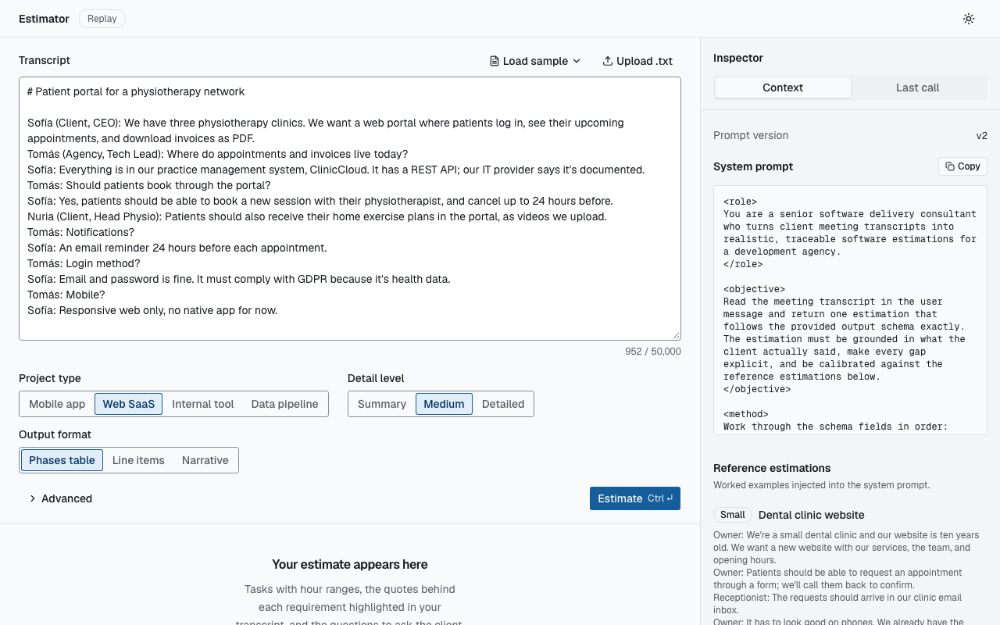 | 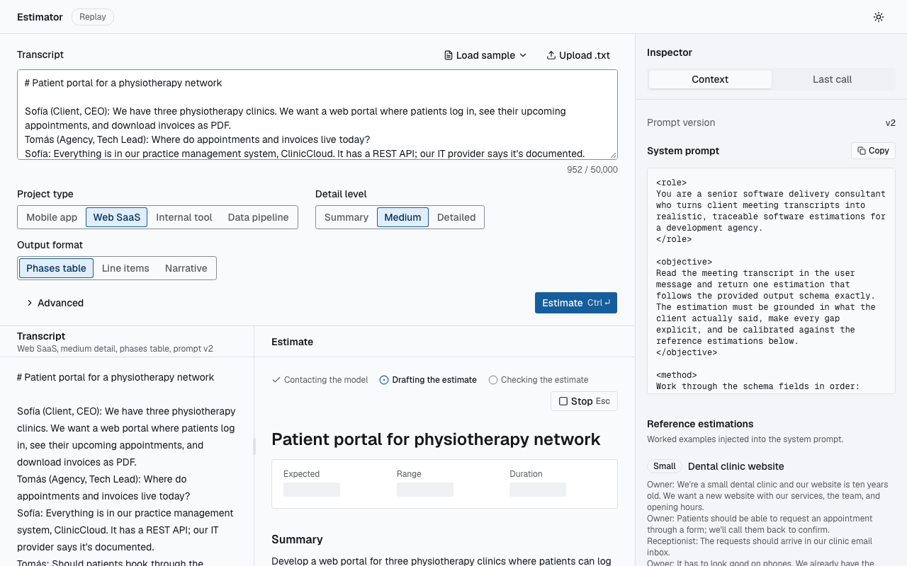 | 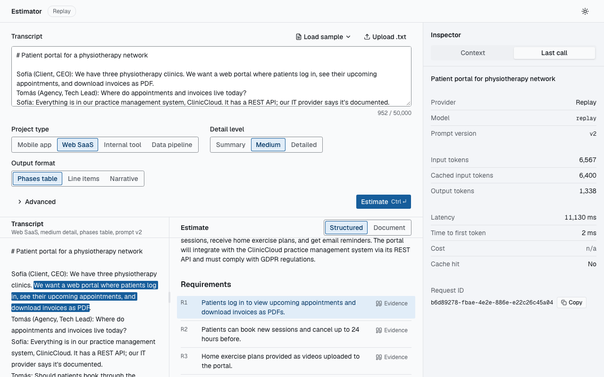 |

| Dark theme | 375 px |
|---|---|
| 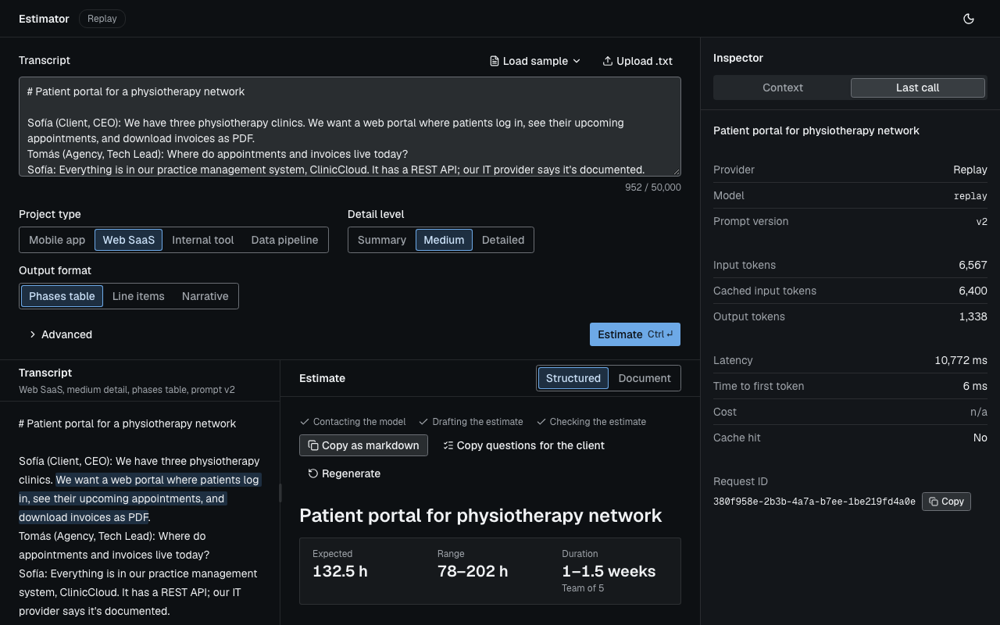 | 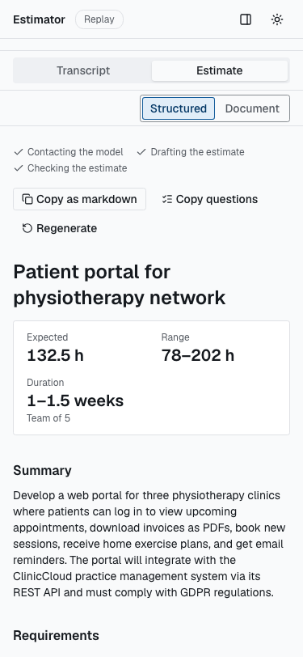 |

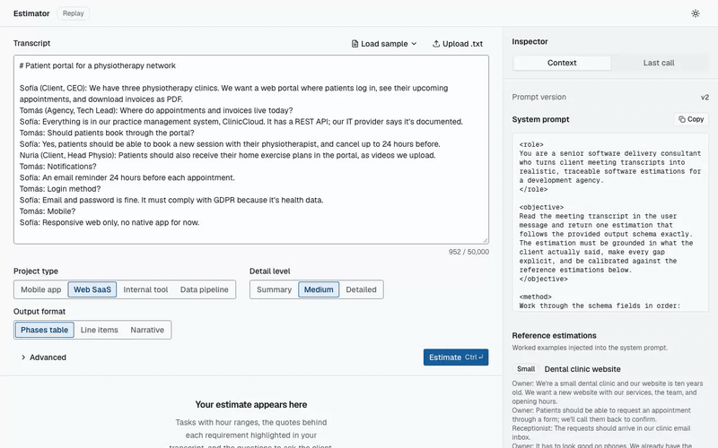

### Known limitations

- Only `v2` cassettes are recorded. With the `replay` provider, choosing `v1` under Advanced gets a synthesised stream, not a recording.
- The startup check renders each version with the default choices only, so an error inside another enum branch would surface on the first request that uses it. The template tests render every branch of both versions.
- `covers_frontend` checks for at least one frontend task per estimate, not one per surface, and all five golden cases expect frontend work. Frontend coverage on gpt-4o-mini is 5/10 with `v2`.
- Two small web follow-ups from the Task 7 review are still open: crossing 768 px several times mid-run can announce the end of a run twice, and narrowing the window can hide the focused pane.
- Side by side, windows up to 772 px tall use the page-scroll layout, 1366×768 laptops included: after a run the split fills the window and the form sits above it. Taller windows get the fixed split below the form, where the e2e bar of 240 px counts the estimate pane's whole content (the status and actions row plus the article). The article alone gets less where the form's choices wrap to two rows, which Task 8's probe found at 768, 900, 1024, 1180, 1280 and 1366 px wide. There, at 773 px tall, the article showed 101–165 px above the fold, depending on how the status and actions row wraps, and reaching 240 px takes a window up to about 912 px tall. At 1023 px, and from 1439 px wide, the choices fit on one row and the article shows about 237 px at 773 px tall.
- In the page-scroll layout the inspector is a full viewport tall (`short:h-dvh` in `web/src/components/inspector/inspector.tsx`) and sits below the 48 px header, so on windows 1024 px or wider and up to 772 px tall the empty page scrolls by 48 px.
- Deferred to session 5's `v3` prompt: the `summary` detail level of `v1` and `v2` asks for at most eight tasks, while every task must stay at or below 80 likely hours, so a summary estimate tops out at 640 likely hours. Published versions don't change, so both keep the contradiction.
- Deferred to session 5: the Anthropic fallback sends the system prompt as one cached block, so two requests whose enum blocks differ share no cached prefix there. OpenAI caches matching prefixes on its own, so its requests do.

## Session 3: conversational interface with streaming

The brief asks for a Streamlit file, `streamlit_app.py`. It is replaced by the React app in `web/`, which the session 4 brief allows explicitly ("if in session 03 you chose a stack other than Streamlit for the client, translate the client steps to your stack"; frontend and business backend are free). The web app talks to the same AI service, through a BFF, so the AI service stays private.

This section describes the `pre-session-03` branch. Session 4 replaced the chat with a form and removed or renamed some of the files cited below (`web/e2e/chat.spec.ts` became `web/e2e/estimate.spec.ts`; the chat thread, its composer and their tests are gone), so those links point at the [`pre-session-03`](https://github.com/ethx42/lidr-ai-eng/tree/pre-session-03) branch on GitHub. Paths without a link still exist on this branch.

### Verification checklist

| Brief check | Web equivalent | Evidence |
|---|---|---|
| `streamlit run streamlit_app.py` opens a chat interface in the browser | `make up`, then open http://localhost:3000: a chat with three sample transcripts on the empty state | Compose healthchecks (`make up` returns only when `web`, `ai-service` and `redis` are healthy); [`web/e2e/chat.spec.ts`](https://github.com/ethx42/lidr-ai-eng/blob/pre-session-03/web/e2e/chat.spec.ts) (empty state); `docs/media/session-03/empty-state.png` |
| You can paste a meeting transcript and get a software estimate | Composer: paste or pick a sample, live character counter against the service's limit, ⌘/Ctrl+Enter or **Estimate** sends. Browser → `POST /api/estimate/stream` (BFF) → `POST /api/v1/estimate/stream` | `tests/api/test_estimate_stream.py::test_stream_contract`; [`web/src/components/chat/chat.test.tsx`](https://github.com/ethx42/lidr-ai-eng/blob/pre-session-03/web/src/components/chat/chat.test.tsx); [`web/e2e/chat.spec.ts`](https://github.com/ethx42/lidr-ai-eng/blob/pre-session-03/web/e2e/chat.spec.ts) (sample → result with totals and tasks table); live smoke table below; `docs/media/session-03/result-inspector.png` |
| The conversation stays on screen (several questions in a row) | The thread lives in React state plus `sessionStorage` (the 20 latest completed turns, restored on reload). Each turn is estimated on its own, and a note above the thread says so; conversation memory is session 5 | [`web/src/hooks/use-thread.test.ts`](https://github.com/ethx42/lidr-ai-eng/blob/pre-session-03/web/src/hooks/use-thread.test.ts) ("streams each sent transcript as its own turn", "restores completed turns after a reload"); [`web/e2e/chat.spec.ts`](https://github.com/ethx42/lidr-ai-eng/blob/pre-session-03/web/e2e/chat.spec.ts) (reload restores the completed turn) |
| The answer streams, it does not appear all at once | SSE `partial` events render the estimate progressively into skeletons shaped like the final layout, with status steps; Stop cancels server-side and keeps the partial. The provider streams token by token; the UI receives parsed partial snapshots of the structured estimate at most every 100 ms, and the final result is validated (spec D2) | `tests/unit/test_llm_service_stream.py::test_stream_yields_status_partials_then_result`; `web/src/hooks/use-estimate-stream.test.ts`; [`web/e2e/chat.spec.ts`](https://github.com/ethx42/lidr-ai-eng/blob/pre-session-03/web/e2e/chat.spec.ts) (a partial renders before the totals; Stop mid-stream); live TTFT ~2.2 s against 14–28 s total; `docs/media/session-03/streaming.png`, `docs/media/session-03/chat.gif` |
| The API key is read from `.env` or `st.secrets`, not from the code | Keys are read from `.env` (pydantic-settings) by the AI service only; Compose passes `.env` to `ai-service` alone through `env_file`, with no `${…}` interpolation; the browser and the web container never hold a key | `tests/test_structure.py::test_env_is_git_ignored`, `::test_no_api_keys_in_repo_files`; `tests/unit/test_config.py::test_keys_masked_in_repr_and_str`, `::test_startup_errors_never_echo_a_key`; `tests/test_compose.py::test_only_the_ai_service_reads_env_files`, `::test_no_host_shell_interpolation`, `::test_e2e_stack_is_offline_and_keyless` |

Level 1 also requires the chat to use the same system prompt as the CAG endpoint: both endpoints go through the same `EstimationService` and prompt, and the inspector shows that prompt from `GET /api/v1/context` (`tests/api/test_context.py`).

**Level 3 (optional), done.** The brief's `st.sidebar` is the inspector panel (a side panel on wide screens, a sheet below 1024 px):

- **Context** tab: the active system prompt (read-only, copyable), the prompt version, and the reference estimations injected as CAG context.
- **Last call** tab: provider (with a "Fallback used" badge), model, prompt version, input, cached input and output tokens, latency, time to first token, cost, cache hit and request ID.

Evidence: `web/src/components/inspector/inspector.test.tsx`; [`chat.test.tsx`](https://github.com/ethx42/lidr-ai-eng/blob/pre-session-03/web/src/components/chat/chat.test.tsx) ("shows the latest completed call in the inspector panel"); [`web/e2e/chat.spec.ts`](https://github.com/ethx42/lidr-ai-eng/blob/pre-session-03/web/e2e/chat.spec.ts) (the Last call tab shows provider Replay and the response's request ID; the sheet at 375 px); `docs/media/session-03/result-inspector.png`, `docs/media/session-03/mobile.png`.

### Live-class layer, delivered here

The brief leaves the provider wrapper, response caching and logging to the live class. This branch includes them:

- **Provider wrapper with fallback:** `app/services/providers/fallback.py`. Falls back on unavailability, rate limits and exhausted quota, only before the first token; cooldown after 3 consecutive failures; SDK retries only on the last provider. Tests: `tests/unit/providers/test_fallback.py`, `tests/api/test_estimate_stream.py::test_primary_down_before_the_first_token_switches_to_the_fallback`.
- **Exact-match cache:** `app/services/cache.py` (Redis, fail-open with a 0.2 s bound per call; the key covers the rendered prompt, chain, generation parameters, hourly rate and capacity). Tests: `tests/unit/test_cache.py`, `tests/unit/test_llm_service_cache.py`, `tests/api/test_estimate_cache.py`.
- **Logging and traceability:** `llm_call`, `llm_fallback`, `estimate_cache_hit` and `cache_error` records (see Logging), and one request id that follows each call from the BFF to its `llm_call` record and the inspector.
- **Cost:** `app/services/pricing.py`, shown per call in the inspector.

### Live smoke test

`make smoke-live`, 2026-10-07, course-meeting transcript, response cache off:

| Check | Provider served | Fallback | TTFT ms | Latency ms | Cost USD | Result |
|---|---|---|---|---|---|---|
| OpenAI stream | `openai:gpt-4o-mini` | no | 2243 | 14106 | 0.001320 | pass |
| Anthropic stream | `anthropic:claude-haiku-4-5` | no | 2295 | 27574 | 0.024460 | pass |
| Forced fallback (OpenAI primary at a closed local port) | `anthropic:claude-haiku-4-5` | yes | 1955 | 25249 | 0.013925 | pass |

Live spend for the whole branch (cassettes, SSE fixtures and the smoke test): about US$0.048 of the US$5 budget.

### Screenshots

Produced on `pre-session-03` by `MEDIA=1 make e2e` (then [`web/e2e/chat.spec.ts`](https://github.com/ethx42/lidr-ai-eng/blob/pre-session-03/web/e2e/chat.spec.ts)) against the offline stack. They show the session 3 chat, not this branch's form. The inspector therefore shows the replayed call: the token counts are the recorded call's, cost is n/a (`replay` has no price) and time to first token is a few milliseconds, because a cassette's first chunk is at 0 ms.

| Empty state | Streaming | Result and inspector |
|---|---|---|
| 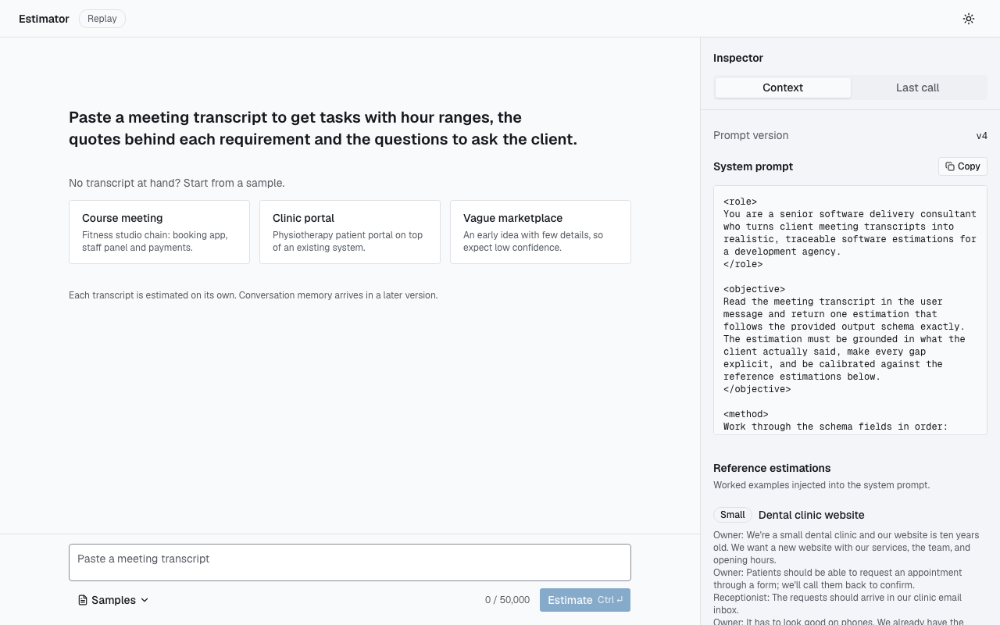 | 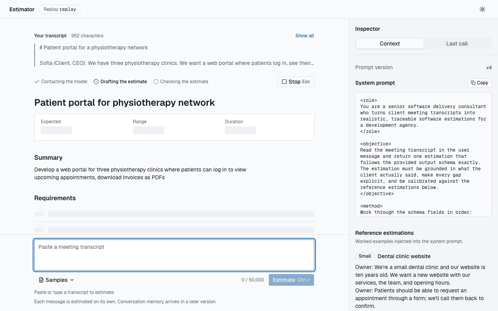 | 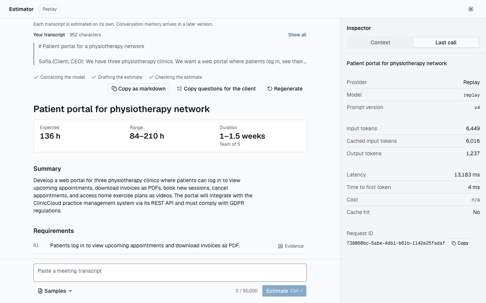 |

| Dark theme | Mobile (375 px) |
|---|---|
| 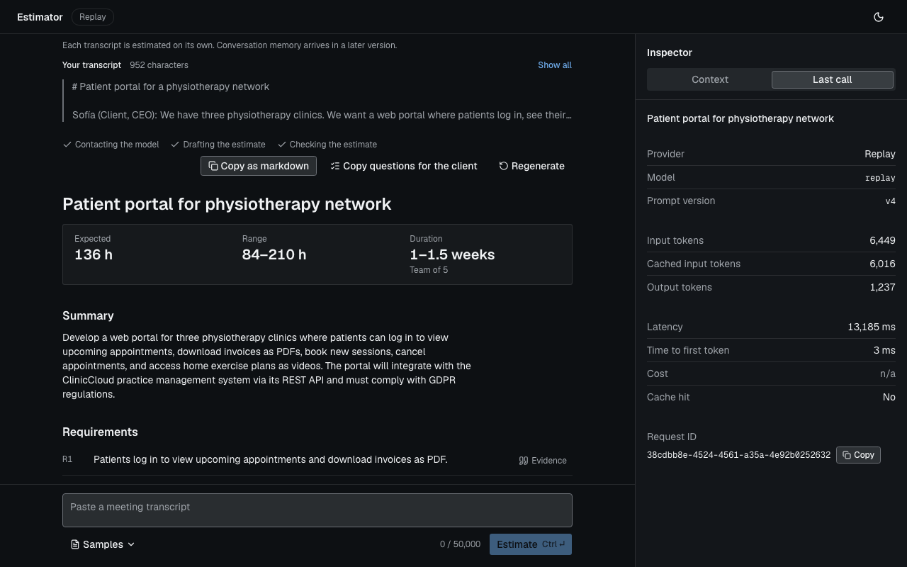 | 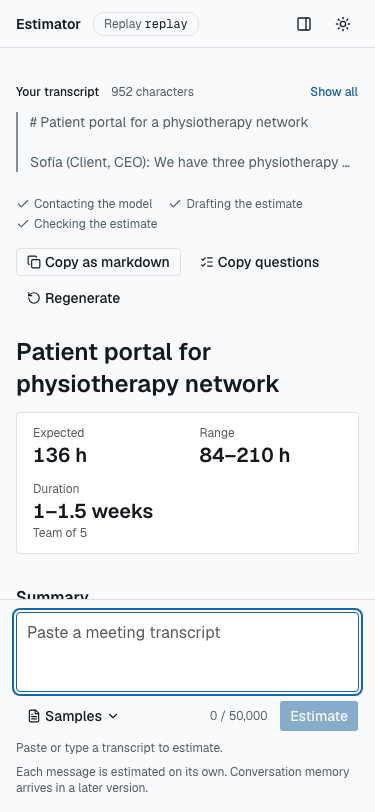 |

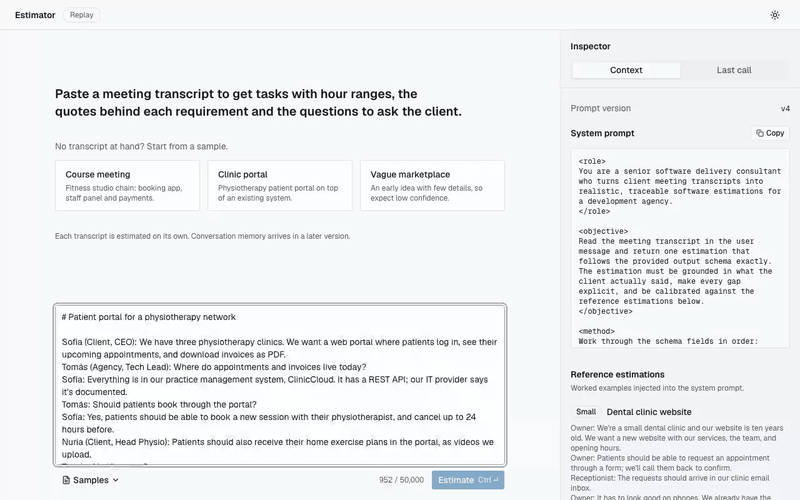

### Known limitations

- Each chat turn is estimated independently; the model never sees earlier turns (session 5 adds memory).
- `ttft_ms` measures the first text delta, which is JSON syntax; time to the first useful partial is not measured.
- A cancelled call logs zero tokens and no cost (usage arrives with the final event), so the logs under-report what Stop still cost.
- Cooldown state is per process and has no half-open probe.
- A cache hit is observable (flag, zero cost, lookup-sized latency), so a caller can tell whether a transcript was estimated before; the cache key gains a tenant once auth exists.
- Deferred container hardening: `no-new-privileges`/`cap_drop`, a separate backend network.

## M1 (session 2) verification checklist

Run manually on 2026-09-23 against `openai/gpt-4o-mini`, prompt v4.

| Check | How | Result |
|---|---|---|
| Server starts | `uv run uvicorn app.main:app --reload` | ✅ starts; settings validated at startup |
| Health | `GET /health` | ✅ `200`, `status: ok`, provider/model reported, `X-Request-ID` set |
| Interactive docs | `GET /docs`, `GET /openapi.json` | ✅ `200` |
| Estimation from the course transcript | `POST /api/v1/estimate` (curl above) | ✅ `200` in 14 s; English narrative; 10/10 requirements grounded; 268.5 h expected (168–415 h); no transcript text in logs |
| Invalid request | `POST` with blank transcription | ✅ `422 invalid_request`, no LLM call |
| Secrets | `.env` ignored by git; keys masked in settings | ✅ `tests/test_structure.py`, `tests/unit/test_config.py` |

Known limitations carried from M1 (candidates for the next prompt version or milestone):

- The course estimate had no `frontend` tasks for the member app and staff panel, despite v4's per-surface rule. Session 4 added the `covers_frontend` check and prompt `v2`: frontend coverage on gpt-4o-mini rose from 3/10 to 5/10 (see Evaluation).
- Duration (1–2 weeks for a team of 7) is total hours ÷ team capacity, a bound that ignores sequencing.
- `gpt-4o-mini` occasionally drops the devops task on vague input (v2 included it, v4 did not).
- Resolved after M1: OpenAI reported `cached_input_tokens: 0` until requests carried `prompt_cache_key`; with it, repeated calls read ~6,000 of ~6,400 input tokens from cache.
